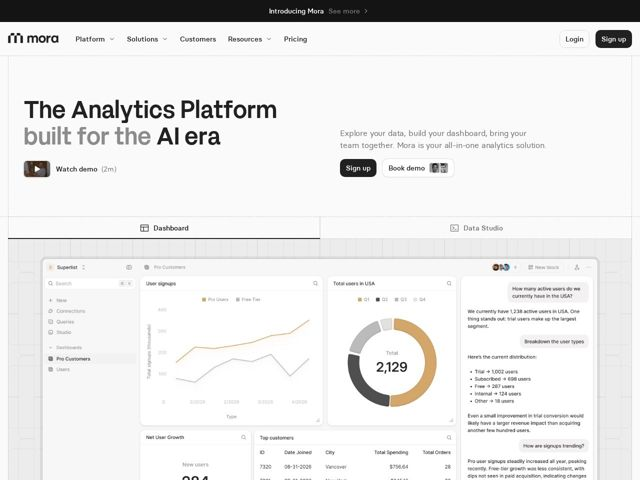

# Index — https://index.app

- **niche:** ai-data-analytics
- **mood:** clean-light
- **style:** minimal, bento, mono-type
- **palette:** bg `#FAFAF8` · ink `#161616` · accent `#C99A4E` — apenas em data-viz: séries de gráfico de linha, segmentos de gráfico de rosca e a linha ativa Pro Customers no screenshot de UI do produto — nunca em botões ou na nav
- **type:** display *grotesca estilo Neue Haas / Helvetica (apertada, quase-condensada)* · body *mesma grotesca humanista em peso mais leve* — precisão de engenharia, quase com cara de terminal; display grande de entrelinha apertada com traços de baixo contraste sinaliza 'ferramenta, não brinquedo'
- **sections:** announcement-bar › nav › hero › product-tabs-screenshot › feature-ask-anything › feature-teams › feature-security › feature-ship-like-code › feature-enterprise-control › testimonials › cta › footer
- **signature:** O hero fica dentro de uma moldura técnica de desenho tracejada/pontilhada literal com marcas de corte, e o screenshot do produto sangra por trás de uma tênue grade de engenharia — a página é emoldurada como um blueprint de CAD em vez de um canvas de marketing SaaS reluzente.
- **imagery:** UI real de produto em alta fidelidade como o ativo do hero (dashboard de analytics com gráficos de linha/rosca mais um painel de chat de IA respondendo 'How many active users in USA?'), posto sobre guias de papel-quadriculado pontilhado; uma diminuta thumbnail de vídeo em pixel-art e chips 'Book demo' com avatares empilhados adicionam uma textura feita-à-mão, de baixo brilho.
- **copy:** Título confiante de reivindicação-de-categoria com uma ênfase em dois tons de cinza-para-preto: 'The Analytics Platform built for the AI era' — a voz é declarativa, par-de-desenvolvedor ('Ship analytics like you ship code'), zero adjetivos de hype.

**Takeaways (roube como ideias, não copie):**
- Use a cor de acento APENAS dentro da visualização de dados, deixando todo o chrome preto/branco — o ocre suave se lê como 'dados reais' em vez de decoração
- Envolva o hero numa moldura de desenho tracejada com marcas de corte nos cantos para telegrafar 'ferramenta de precisão' antes que uma única palavra seja lida
- Dê dois tons ao título (oração secundária em cinza, palavra-chave em preto) para direcionar o olhar para 'AI era' sem truques de negrito/tamanho
- Coloque o screenshot real do chat de IA respondendo uma pergunta bem à frente e ao centro como prova, com abas Dashboard vs Data Studio, em vez de uma ilustração abstrata
