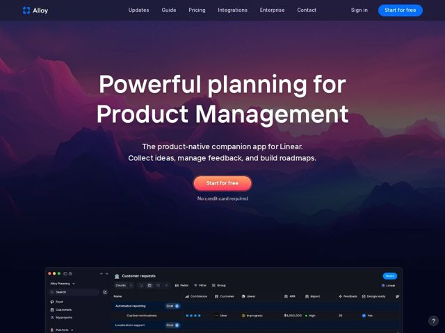

# Index — https://index.inc

- **niche:** dev-tools
- **mood:** technical-dark
- **style:** dark, gradient, cinematic
- **palette:** bg `#0E0B1A` · ink `#FFFFFF` · accent `#F47A52` — o único botão de CTA principal (pílula de gradiente coral->âmbar quente 'Start for free') e pequenos pontos de status dentro da UI do produto; todo o resto é azul/violeta frio, de modo que o acento quente é dono da conversão
- **type:** display *Sans grotesca geométrica (estilo Poppins / Futura, peso pesado, tracking apertado)* · body *Sans humanista neutra (system / tipo Inter)* — Título geométrico arredondado com bojos generosos se lê como amigável-mas-confiante; a escala superdimensionada faz um H1 de 6 palavras parecer um pôster, não um slogan
- **sections:** hero › feature-overview › feature-flexibility › feature-raycast › cta › feature-notion-switch › feature-discovery › footer
- **signature:** Uma paisagem fotográfica e cinematográfica de cordilheira de montanhas sangra de borda a borda atrás do hero em vez do obrigatório screenshot de dashboard de ferramenta-de-dev ou da malha de gradiente abstrata — a UI real do produto é rebaixada a uma janela de navegador flutuante que se sobrepõe à dobra abaixo, de modo que a 'vista' emocional vende antes que o produto venda.
- **imagery:** Dois registros: (1) uma paisagem atmosférica e dessaturada de montanha ao crepúsculo (picos violeta/magenta dissolvendo-se em quase-preto) como pano de fundo do hero, evocando horizonte/planejamento; (2) um screenshot de produto hiper-detalhado em modo escuro renderizado dentro de um chrome realista de navegador macOS, repleto de dados de tabela com cara de reais (ARR, Confidence, Impact, pílulas de status do Linear) para sinalizar densidade e credibilidade.
- **copy:** Título de benefício falado de forma simples + subtítulo de posicionamento apertado nomeando o parceiro de integração — H1: 'Powerful planning for Product Management', sub: 'The product-native companion app for Linear.'

**Takeaways (roube como ideias, não copie):**
- Ancore uma ferramenta num ecossistema: o subtítulo nomeia o Linear ('companion app for Linear') e uma seção inteira é construída em torno de 'Access from anywhere with Raycast' — pegue confiança emprestada posicionando-se ao lado de ferramentas que os usuários já amam.
- Disciplina de acento quente-sobre-frio: mantenha a paleta inteira fria (azul/violeta) e reserve um único gradiente quente (coral->âmbar) exclusivamente para o CTA principal, de modo que o olhar tenha exatamente um lugar para ir.
- Venda o sentimento, depois prove-o: hero = paisagem aspiracional com quase-zero UI; a tabela densa de dados aparece só conforme você rola, separando o desejo da prova.
- Emoldure a UI do produto num chrome de SO real (semáforos do macOS, abas de navegador, botão Share) com dados de amostra críveis — lê-se como uma ferramenta ao vivo, não um mockup de marketing.
