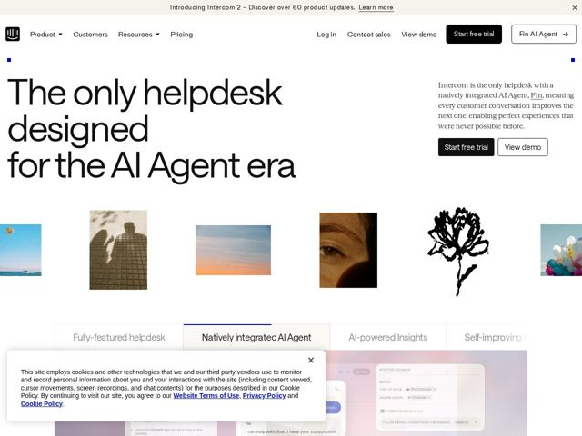

# Intercom — https://intercom.com

- **niche:** ai customer-support / helpdesk
- **mood:** clean-light
- **style:** minimal, editorial-minimal, mono-type, photographic
- **palette:** bg `#FFFFFF` · ink `#1A1A1A` · accent `#1A1A1A` — Tiny square electric-blue/cobalt registration dots flanking the hero; otherwise contrast is carried by the black 'Start free trial' button and underlined active tab. Accent is nearly absent — restraint IS the move.
- **type:** display *Custom heavy grotesque (Intercom display sans, in the lineage of a tightly-tracked neo-grotesque like a bold ABC/Söhne-style face)* · body *Humanist serif for the hero subhead (transitional/old-style serif), grotesque sans for nav and UI labels* — Oversized, ultra-tight-tracked black display headline set against a delicate serif paragraph — confident, almost print-magazine editorial, not the usual rounded-friendly SaaS sans
- **sections:** banner-announcement › hero › feature-gallery-imagery › tabbed-feature-switcher › feature-ai-agent-workspace › feature-seamless-experience › feature-insights › feature-self-improving › feature-world-class-agent › how-it-works › trust-domain-expertise › pricing › cta › footer
- **signature:** A row of unrelated, almost art-gallery photographs — a kite over the sea, two silhouettes on tile, a sunset with birds, a close-up of an aging eye, an ink-brush flower — strung horizontally beneath the headline. It reads like a museum wall, not a product UI. A B2B helpdesk page deliberately shows zero dashboards in the hero and leads with human, emotional, editorial imagery instead.
- **imagery:** Curated full-bleed art photography in mixed aspect ratios (portrait + landscape framed images) treated like an editorial photo essay — humans, nature, an ink illustration — evoking 'human experiences' rather than software. Product UI screenshots are demoted below the fold, shown in soft pastel-gradient panels only after the emotional hook lands.
- **copy:** Bold category-ownership claim in plain language, serif-softened — hero reads 'The only helpdesk designed for the AI Agent era'; voice is declarative, definitive, confidently understated.

**Takeaways (steal as ideas, don't copy):**
- Pair a massive black grotesque headline with a small old-style serif body paragraph — the serif/sans contrast instantly signals editorial confidence over generic SaaS friendliness.
- Lead a B2B product page with a horizontal gallery of emotional human/nature photography and hide the dashboard screenshots below the fold — sell the feeling first, the UI second.
- Use the 'The only ___' construction to claim a category outright, then back it in a single restrained serif sentence rather than a feature dump.
- Carry contrast almost entirely in black-on-white and let a single tiny saturated accent (a 4px cobalt square) be the only color — scarcity makes the accent louder than a full palette would.
