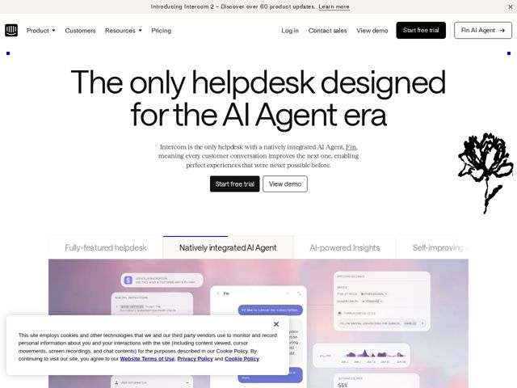

# Intercom — https://intercom.io

- **niche:** dev-tools
- **mood:** editorial-minimal
- **style:** minimal, clean, colorful
- **palette:** bg `#F7F6F2` · ink `#1A1A1A` · accent `#3B43F0` — Tiny square corner markers framing the hero, the active feature-tab underline, the inline 'Fin' text link, the chat bubbles in the product UI, and the 'Fin AI Agent' button outline
- **type:** display *GT Walsheim / geometric grotesque (Intercom's custom sans, single-weight regular)* · body *Georgia-style transitional serif (used for subhead and body paragraphs)* — Confident, oversized, near-thin headlines paired with a quiet bookish serif — editorial calm, not startup-loud
- **sections:** hero › feature-tabs › feature-complete-solution › feature-helpdesk › feature-insights › feature-self-improving › feature-fin-agent › feature-channels › feature-engagement › feature-monitoring › problem-trust › feature-expert-support › how-it-works › pricing › cta › footer
- **signature:** A hand-drawn, scratchy black ink peony bloom floating loose in the hero's right margin — an analog botanical illustration colliding with an AI-helpdesk pitch. It signals craft and warmth where competitors default to abstract 3D blobs.
- **imagery:** Real product-screenshot UI as the centerpiece, but staged on a soft lavender-to-peach gradient-mesh backdrop so the chrome feels airy rather than boxy. Layered floating cards (chat thread, guidance panel, billing chart) overlap at depth. Punctuated by sparse hand-inked line illustrations.
- **copy:** Singular authority claim in plain language — "The only helpdesk designed for the AI Agent era" — backed by a serif subhead that argues the mechanism ("every customer conversation improves the next one"). Voice: declarative, category-owning, unhurried.

**Takeaways (steal as ideas, don't copy):**
- Pair a huge near-thin geometric-sans headline with a small transitional SERIF body block — the serif does the persuading and reads as editorial confidence, a deliberate counter to the all-sans SaaS default.
- Frame the hero with four tiny accent-colored square corner ticks instead of a box or full-bleed image — a minimal 'crop mark' device that adds structure on an off-white canvas with almost no ink.
- Drop one loose hand-drawn ink illustration into white margin space to inject warmth/craft into a technical product and break the screenshot monotony.
- Make features a horizontal tabbed switcher above a single live product canvas (active tab gets the accent underline), so one screenshot region does the work of four stacked sections.
