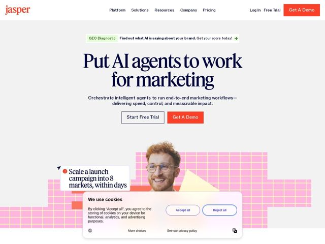

# Jasper — https://jasper.ai

- **niche:** ai
- **mood:** editorial-minimal
- **style:** editorial, mono-type, illustrated, colorful
- **palette:** bg `#F1F0EE` · ink `#1A1B3A` · accent `#FF4D1C` — logotipo, botões de CTA primários (Get A Demo), pequeno ícone de informação do card de notificação e um bloco geométrico avulso na colagem do hero
- **type:** display *Serifa transitional de alto contraste (no estilo Tiempos / Canela) com tracking óptico apertado* · body *Sans-serif neo-grotesca (próxima de uma Inter/Aktiv Grotesk customizada)* — Literário encontra utilitário: uma serifa de publicação do velho mundo combinada com uma sans moderna e limpa sinaliza ofício e autoridade editorial, e não o futurismo típico de ferramentas de IA
- **sections:** hero › logos › feature-platform › feature-why-choose › feature-solutions › testimonials › feature-security › feature-resources › cta › faq › footer
- **signature:** Uma cabeça humana fotográfica (um profissional de marketing sorrindo) colada sobre uma grade de papel quadriculado neon-rosa desenhada à mão, com formas geométricas de papel recortado — uma estética de scrapbook/zine inserida numa página de IA corporativa, o oposto dos clichês de IA com gradientes brilhantes
- **imagery:** Colagem editorial em técnica mista: fotografia real recortada de pessoas em camadas sobre fundos planos de grade pautada rosa e recortes de papel amarelo/laranja, com cards flutuantes de notificação de UI (chips brancos arredondados com um ponto de info laranja) que imitam alertas de produto. Sensação tátil, feita à mão, de spread de revista, em vez de screenshots renderizados
- **copy:** Comando imperativo confiante que nomeia o novo paradigma — o hero diz "Put AI agents to work for marketing", o subtítulo promete "speed, control, and measurable impact"; a voz é direta, orientada a resultados, com credibilidade corporativa

**Takeaways (roube como ideias, não copie):**
- Combine uma serifa de publicação de alto contraste em tamanho display gigante com um corpo em grotesca simples — a serifa faz todo o trabalho de personalidade da marca e se lê na hora como 'ofício', não 'startup de IA'.
- Ancore o hero num off-white quente (#F1F0EE) em vez de escuro/gradiente, depois deixe um único acento vibrante (laranja) carregar todos os CTAs — a contenção torna o único acento mais alto.
- Construa a imagética do hero a partir de primitivas de colagem (grades de papel quadriculado, formas de papel recortado, recortes de fotos reais, chips de alerta flutuantes) em vez de screenshots de produto — mostra o produto em uso como um sentimento, não como um tour de UI.
- Faça flutuar cards de notificação de produto falsos-mas-realistas (ex.: 'Scale a launch campaign into 8 markets, within days') sobre a colagem para telegrafar resultados sem mostrar a interface.
