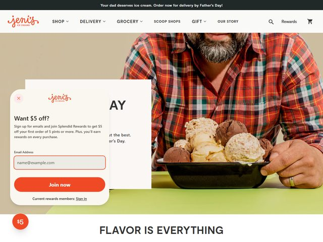

# Jeni's Splendid Ice Creams — https://jenis.com

- **niche:** food
- **mood:** warm-playful
- **style:** photographic, warm, retail, appetite-driven
- **palette:** bg `#E9E3D6` · ink `#2B2B2B` · accent `#EE5A24` — A hot tangerine-orange carries the whole brand: the script logo, the floating "$5" coin badge, the primary "Join now" button, and the announcement bar all glow the same warm orange against muted neutrals.
- **type:** display *handwritten brush script for the "jeni's" wordmark, paired with a heavy geometric sans (Sharp Grotesk / Founders Grotesk) for "FLAVOR IS EVERYTHING"* · body *clean humanist sans (Aktiv Grotesk / Inter)* — Friendly and confident; the script signs the brand by hand, the slab-heavy sans states the manifesto.
- **sections:** hero › flavor-grid › build-your-pack › seasonal-collection › story-craft › press-quotes › cta › footer
- **signature:** The hero is a tightly cropped lifestyle photo — a bearded man in an orange-and-green plaid shirt cradling a black bowl heaped with four giant scoops (chocolate, vanilla, caramel swirl) on a lime-green table. The framing deliberately decapitates the subject to keep all attention on the ice cream and the warmth of the hands. The plaid shirt's orange/green echoes the brand orange and the green tabletop, so the human, the product, and the palette are one continuous warm composition rather than a model posed beside a product.
- **imagery:** Editorial food photography with natural light and shallow warmth — real scoops with visible texture and melt, real human hands, a real table. No 3D, no illustration, no studio sterility; the appetite appeal IS the photo. A small flat "$5" circular badge floats over it as the only graphic element.
- **copy:** Seasonal, conversational, gift-led. Announcement bar reads "Your dad deserves ice cream. Order now for delivery by Father's Day!"; the hero headline (partly behind the email modal) reads "...DAY" with supporting copy "...t the best. ...er's Day." — a Father's Day campaign push. The email capture overlay leads with "Want $5 off?" and the CTA button says "Join now."

**Takeaways (steal as ideas, don't copy):**
- Crop the model out of frame (no face) so the food and the hands become the hero — intimacy without a posed portrait.
- Tie the talent's wardrobe to the brand palette (orange plaid, green table) so the photo reads as one designed color story, not a stock shot.
- Let a single hot accent do everything — logo, badge, CTA, announcement bar — for instant brand recall against muted neutrals.
- Pair a hand-drawn script wordmark with a heavy geometric sans manifesto line ("FLAVOR IS EVERYTHING") to get warmth and authority at once.
