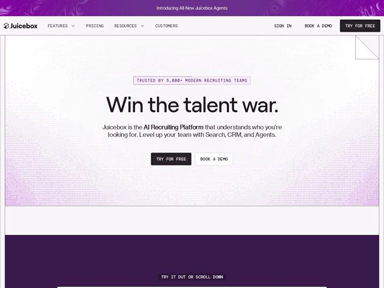

# Juicebox — https://juicebox.ai

- **niche:** ai-recruiting (HR tech / dev-tools-adjacent AI platform)
- **mood:** technical-dark
- **style:** mono-type, gradient, minimal
- **palette:** bg `#F4F2F3` · ink `#1A1420` · accent `#7A2E8E` — top announcement bar and footer band fill purple; soft magenta/violet gradient bleeds in from the hero corners; pill-badge border, bold inline phrase 'AI Recruiting Platform', and the printed-circuit dotted texture along the edges
- **type:** display *Geometric humanist sans (rounded grotesque, e.g. a Sofia/Gellix-style face) for the oversized hero headline* · body *Neo-grotesque sans for paragraph copy; all UI chrome (nav, badge, buttons, scroll cue) set in an uppercase letter-spaced monospace* — Confident and engineered: a big friendly rounded headline collides with terminal-style mono microcopy — feels like a product built by engineers but sold to humans
- **sections:** announcement-bar › hero › manifesto-statement › how-it-works › feature-agents › logos-integrations › testimonials › feature-roadmap › faq › cta › footer
- **signature:** The entire UI chrome is rendered in uppercase letter-spaced MONOSPACE — nav links, the trust badge, both CTA buttons, even the 'TRY IT OUT OR SCROLL DOWN' cue — while the hero headline is a giant soft rounded sans. That mono-everything-but-the-headline split, plus a faint printed-circuit-board dot texture framing the canvas, breaks the slick HR-SaaS gradient convention and reads like a developer tool.
- **imagery:** No photography or character illustration in the hero. Visual language is texture + framing: a near-white paper canvas edged by a faint purple printed-circuit dot/halftone gradient that bleeds from the corners, plus a small folded dog-ear in the top-right corner. Imagery is implied rather than shown — the product UI is teased below the fold via the scroll cue.
- **copy:** Combative, declarative two-word power statement over feature-listing — real hero: "Win the talent war." then a plain-spoken subhead "Juicebox is the AI Recruiting Platform that understands who you're looking for. Level up your team with Search, CRM, and Agents."

**Takeaways (steal as ideas, don't copy):**
- Set ALL interface chrome in uppercase letter-spaced monospace (nav, badges, buttons, scroll cue) and pair it with ONE oversized friendly rounded-sans headline — the contrast alone signals 'engineered product, human pitch'.
- Lead with a 2-3 word battle-cry headline ('Win the talent war.') instead of a feature sentence; let the supporting line carry the what.
- Frame a near-white canvas with a faint accent-colored printed-circuit dot texture bleeding in from the corners — color without a flat color block, keeping it light but branded.
- Bookend the page in the brand color: a thin purple announcement bar up top and a solid purple footer band, so the accent brackets an otherwise neutral layout.
