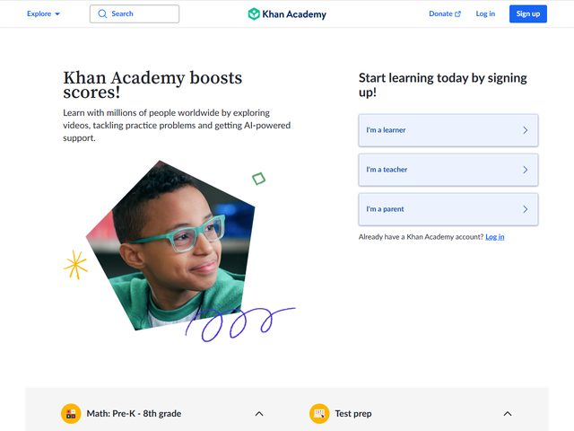

# Khan Academy — https://www.khanacademy.org

- **niche:** education
- **mood:** clean-light
- **style:** photographic, friendly, illustrative-accents
- **palette:** bg `#FFFFFF` · ink `#21242C` · accent `#1865F2` — The blue is split-duty: a saturated royal-blue fills the solid "Sign up" pill top-right and underlines the "Log in" link, while a softer powder-blue tints the three stacked persona selector cards ("I'm a learner / teacher / parent"). Accent = navigation + decision, never decoration.
- **type:** display *humanist sans, Proxima Nova / "Lato" feel, semibold at large size* · body *same family, regular, mid-gray* — Approachable and rounded, not corporate; warm grade-school register, zero Swiss severity.
- **sections:** hero › persona-paths › subject-catalog (Math, Test prep…) › how-it-works › teacher/parent-tools › testimonials › donate-cta › footer
- **signature:** The hero photo of a smiling kid in teal glasses is masked into a hand-drawn-feeling angular polygon (not a rectangle, not a circle) and then surrounded by loose doodle marks — a yellow asterisk-spark, a green outlined diamond, and a scribbled violet ballpoint squiggle underneath. It deliberately mimics a student's own margin sketches, turning a stock-style portrait into something that feels drawn by a kid in a notebook.
- **imagery:** Editorial photography (real student, candid, natural light) cropped into an irregular hand-cut shape, layered with childlike vector doodles in primary-adjacent colors. No 3D, no product-UI; the warmth comes from the photo-plus-scribble collage.
- **copy:** Plain, encouraging, outcome-first — headline "Khan Academy boosts scores!" with subhead "Learn with millions of people worldwide by exploring videos, tackling practice problems and getting AI-powered support." The right rail eyebrow reads "Start learning today by signing up!" Exclamation marks do real tonal work.

**Takeaways (steal as ideas, don't copy):**
- Mask a hero portrait into a hand-cut polygon and ring it with loose doodles to make a polished photo feel kid-made and inviting.
- Split the single accent color into a "strong" shade for the primary action and a "soft" tint for selectable cards — one hue, two jobs, clear hierarchy.
- Replace one generic CTA with a persona-router: three stacked cards ("I'm a learner / teacher / parent") that segment the visitor before they even scroll.
- Lead with the outcome ("boosts scores!") in the headline, then back-fill the mechanism (videos, practice, AI support) in the subhead.
