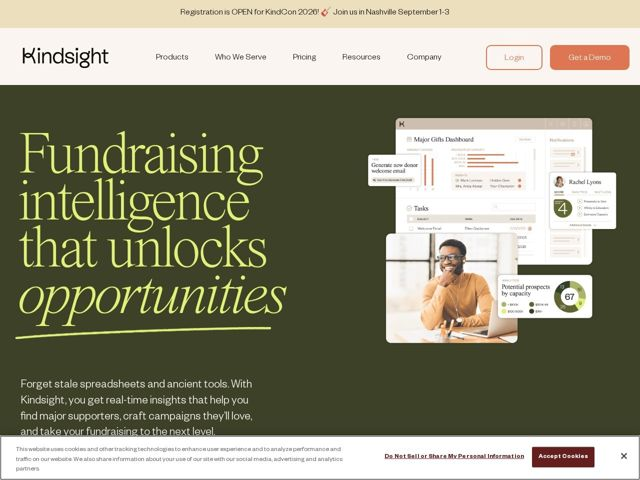

# Kindsight — https://kindsight.io

- **niche:** ai (fundraising/nonprofit intelligence — donor analytics SaaS)
- **mood:** warm-playful
- **style:** editorial, warm, photographic
- **palette:** bg `#3D3D2B` · ink `#F5F1E8` · accent `#C9E265` — a palavra display em itálico 'opportunities' na headline, o floreio de sublinhado desenhado à mão e o botão de CTA laranja 'Get a Demo' como acento secundário
- **type:** display *Uma serifa transitional de alto contraste (híbrido Didone/Old-Style, no estilo ITC-Garamond com ascendentes bem altos e um corte itálico verdadeiro)* · body *Uma grotesca sans humanista neutra (família Inter / Aktiv Grotesk)* — Literário e editorial em cima, calmo e utilitário embaixo — a serifa dá calor e gravidade de causa social, enquanto a sans mantém a história do produto legível e moderna
- **sections:** announcement-bar › hero › logos › feature-find-donors › feature-build-relationships › feature-grow-giving › products-overview › sectors-served › differentiator-values › community › service › support › cta › resources › footer
- **signature:** Posicionar um produto de analytics B2B contra um canvas verde-oliva/militar profundo com uma headline gigante em serifa, onde a palavra do clímax ('opportunities') cai num itálico chartreuse sublinhado por um floreio solto de caneta feito à mão — lê-se como uma carta de apelo de captação de doações, não um dashboard de dados, rejeitando deliberadamente o padrão SaaS de gradiente azul frio.
- **imagery:** Um aglomerado em colagem, levemente inclinado, de cards de UI de produto sobrepostos (Major Gifts Dashboard, chips de pontuação de doadores, gráficos donut de capacidade, rascunhos de e-mail gerados por IA) em camadas sobre uma foto de lifestyle espontânea de uma pessoa sorrindo num laptop — fundindo o calor humano real com a superfície analítica do produto para que os dados pareçam centrados na pessoa em vez de clínicos.
- **copy:** Voz empática, missão-primeiro, que posiciona o software como um parceiro de valores — hero: "Fundraising intelligence that unlocks opportunities" com subtítulo "Forget stale spreadsheets and ancient tools."

**Takeaways (roube como ideias, não copie):**
- Use um inesperado canvas verde-terroso + acento chartreuse em vez do azul SaaS padrão para sinalizar na hora o calor de 'missão/causa social' sem deixar de parecer premium.
- Misture uma serifa literária de alto contraste no hero com uma sans neutra no corpo do produto — deixe a mudança de registro tipográfico carregar a emoção da marca.
- Colora apenas a única palavra do clímax na headline (aqui o itálico 'opportunities') e sublinhe-a com um floreio feito à mão para guiar o olhar e adicionar textura humana e artesanal.
- Faça colagem de cards reais de UI de produto inclinados e sobrepostos por cima de uma foto humana espontânea para que o analytics pareça ligado a uma pessoa e a uma missão, não a um dashboard estéril.
