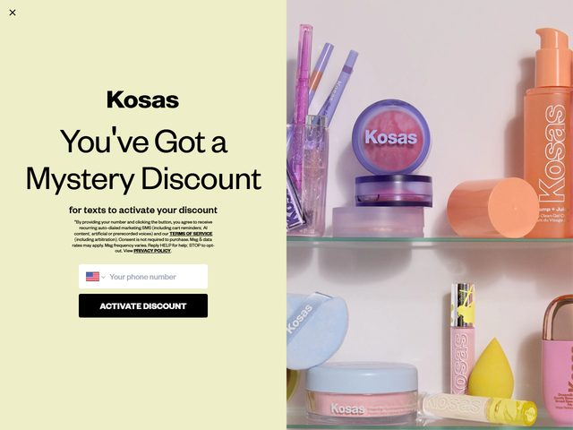

# Kosas — https://www.kosas.com

- **niche:** beauty
- **mood:** warm-playful
- **style:** photographic, candy-pastel, editorial, retail-shelf
- **palette:** bg `#EDEFC0` · ink `#1B1B1B` · accent `#F08A5D` — O painel do modal repousa sobre um bloco chartreuse-pistache suave; o coral quente vem do próprio produto (o frasco do sérum "Plump + Juicy" e a tampa do lip) na prateleira fotografada, não do chrome de UI. O acento é conquistado pela mercadoria, não pintado por cima.
- **type:** display *Serifa de alto contraste no estilo Reckless / GT Sectra (o logotipo "Kosas" é uma grotesca de traço gordo, mas a headline é uma serifa editorial com bracketing)* · body *Neue Haas Grotesk / Helvetica Now em cinza apertado de letra miúda* — Voz confiante de revista glossy combinada com letra miúda pequena e sem rodeios.
- **sections:** hero › bestsellers-grid › skin-tint-shade-finder › ingredient-story › routine-builder › reviews-ugc › press-quotes › cta-email › footer
- **signature:** O "hero" em que você cai é na verdade uma fotografia de lifestyle full-bleed dos produtos Kosas dispostos em prateleiras de varejo de vidro rosa-claro — blushes, esponjas, lip oils, um sérum coral — com a copy de marketing entregue por meio de um card modal creme ancorado à esquerda em vez de tipografia sobreposta. A foto do produto é merchandising de verdade (dá para ler "Kosas" gravado no compacto, na pastilha de pó, na esponja), de modo que a dobra vende a prateleira inteira de uma vez em vez de um único SKU. O card de captura de desconto come o terço esquerdo enquanto a fotografia respira à direita.
- **imagery:** Foto-primeiro, styling de produto editorial glossy — acrílicos pastel e vidro fosco, luz direcional suave, paleta candy (lilás, azul-bebê, amarelo-manteiga, coral, blush). Sem 3D, sem ilustração; é natureza-morta de nível catálogo fotografada para parecer uma shelfie de balcão de beleza.
- **copy:** Voz de conversão divertida e isca de recompensa. Headline diz "You've Got a Mystery Discount", eyebrow/subtítulo "for texts to activate your discount", com um pill preto "ACTIVATE DISCOUNT" sob um campo de número de telefone e letra miúda densa de consentimento de SMS embaixo.

**Takeaways (roube como ideias, não copie):**
- Encene a dobra como uma foto real de prateleira com merchandising (vários produtos, marca gravada em cada um) para que o hero venda o catálogo, não um único SKU principal.
- Divida a dobra: card modal pastel sólido no terço esquerdo para a oferta, fotografia full-bleed respirando à direita.
- Puxe sua cor de acento do produto real no quadro em vez de um swatch de UI — o coral "conquista" seu lugar por ser o sérum.
- Enquadre o gate de e-mail/SMS como uma recompensa de "Mystery Discount" para converter a curiosidade, e mantenha a headline editorial em serifa grande enquanto encolhe a letra miúda de consentimento para uma honesta letra cinza.
