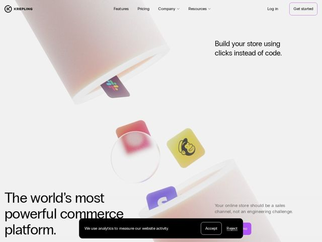

# Krepling — https://krepling.com

- **niche:** ecommerce / commerce platform (no-code store builder)
- **mood:** clean-light
- **style:** minimal, 3d, photographic
- **palette:** bg `#FFFFFF` · ink `#1A1A1A` · accent `#7C5CFC` — o contorno do botão Get-started, o tile roxo de integração Gusto/chat flutuando na colagem do hero e pequenos destaques de CTA
- **type:** display *Sans grotesca geométrica (terminal arredondado, 'a' de um só andar — família Circular/Gilroy)* · body *A mesma sans geométrica em peso mais leve* — Suave, amigável, confiante — formas de letra geométricas arredondadas mantêm uma afirmação poderosa com aparência acessível em vez de corporativa
- **sections:** hero › feature-build-no-code › feature-workflows › feature-storefront › feature-dashboard › feature-integrate › how-it-works › feature-grid › faq › cta › footer
- **signature:** O hero rejeita o screenshot de dashboard de ecommerce padrão. Em vez disso, formas 3D cilíndricas gigantes em rosa-suave flutuam pelo quadro com logos de integração reais (Slack, Mailchimp, Gusto) fisicamente embutidos nelas como cards encaixados numa escultura — transformando a lista de integrações numa natureza-morta tátil e que desafia a gravidade.
- **imagery:** Abstração 3D renderizada: cilindros foscos rosa-claro e uma lente de vidro flutuando em espaço negativo, iluminados suavemente com tons de gradiente blush. Logos de marcas reconhecíveis são montados em pequenos tiles coloridos que cruzam as formas escultóricas, mesclando a iluminação fotorrealista de render de produto com composição de colagem editorial.
- **copy:** Afirmação absoluta e ousada combinada com uma promessa direta — hero: "The world's most powerful commerce platform." com sub-hero "Build your store using clicks instead of code." e o reenquadramento "Your online store should be a sales channel, not an engineering challenge."

**Takeaways (roube como ideias, não copie):**
- Embuta logos reais de parceiros/integrações como objetos físicos dentro da arte 3D do hero em vez de uma faixa plana de logos — prova e estética num só movimento.
- Ancore uma headline grandiosa ('world's most powerful') com uma linha de benefício humilde e concreta ('clicks instead of code') para que a confiança se leia como prestativa, não arrogante.
- Use uma paleta blush-no-branco com um único acento roxo saturado para que a página pareça premium e calma sem deixar de sinalizar os CTAs.
- Enquadre a proposta de valor como um reenquadramento da dor do usuário — 'should be a sales channel, not an engineering challenge' — em vez de uma lista de features.
