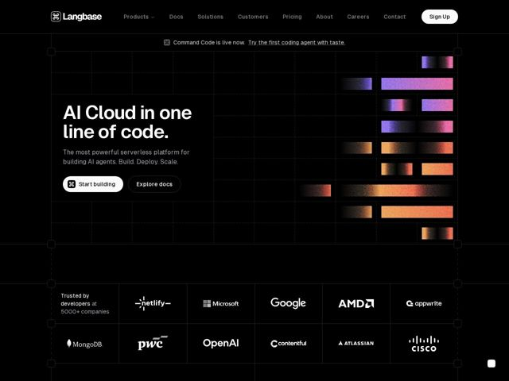

# Langbase — https://langbase.com

- **niche:** ai
- **mood:** technical-dark
- **style:** dark, gradient, mono-type
- **palette:** bg `#000000` · ink `#FFFFFF` · accent `#E08A4A` — grainy sunset gradient blocks (amber/orange/violet/pink) tiled into the hero grid on the right; otherwise the UI is strictly black-and-white
- **type:** display *Geometric grotesque sans (rounded-terminal, Circular/Aeonik-like) for the oversized hero headline* · body *Same humanist grotesque at smaller weight for subhead and body; monospace for the // section labels* — Confident, engineered, developer-native — soft rounded letterforms keep the all-black canvas from feeling cold
- **sections:** hero › logos › feature-command › feature-memory › feature-agents › feature-workflows › feature-ops-evals › community › cta › footer
- **signature:** The hero lives inside a literal blueprint/CAD canvas — a faint dashed selection box with square corner handles frames the whole viewport, and grainy sunset-gradient swatches are dropped into grid cells like color samples on a design tool artboard. It treats the landing page as a developer's workspace, not a marketing poster.
- **imagery:** No product screenshots or 3D in the hero. Instead: abstract grainy duotone gradient rectangles (sunset amber-to-violet, film-grain texture) tiled into an invisible blueprint grid. Mono-color partner logos sit in a bordered grid of cells. The visual language is "design-tool canvas" — selection handles, grid lines, swatch blocks.
- **copy:** Terse engineer-poetry: a category claim, not a feature list — hero reads "AI Cloud in one line of code." with subhead "The most powerful serverless platform for building AI agents. Build. Deploy. Scale."

**Takeaways (steal as ideas, don't copy):**
- Label every section with a monospace code-comment header (// memory, // agents, // workflows) so the page reads like an annotated source file — instant developer credibility.
- Confine all color to grainy gradient swatches dropped into an otherwise pure black-and-white grid; the restraint makes the sunset pops feel like deliberate samples, not decoration.
- Frame the hero in a CAD-style dashed selection box with corner handles to signal 'this is a builder's tool,' turning the whole viewport into an artboard.
- Lead with a one-line category claim ('AI Cloud in one line of code') plus a punchy three-verb promise (Build. Deploy. Scale.) instead of a feature dump.
