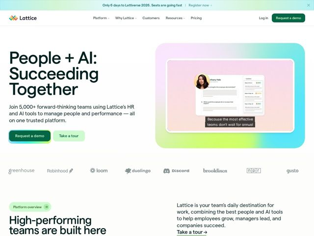

# Lattice — https://lattice.com

- **niche:** hr-people-management (HRIS / performance + AI)
- **mood:** warm-playful
- **style:** gradient, clean, colorful
- **palette:** bg `#FFFFFF` · ink `#0A2E1E` · accent `#1F6B4A` — o botão de CTA primário (com uma borda de gradiente arco-íris), o pill 'Platform overview', os sublinhados de links e o card de gradiente multi-matiz emoldurando a foto do produto no hero
- **type:** display *Sans humanista geométrica (customizada da Lattice, no estilo Aktiv Grotesk), tracking apertado, peso pesado* · body *A mesma sans humanista em peso regular, entrelinha generosa* — Confiante e moderna mas de cantos suaves — headlines grandes e em negrito parecem assertivas, mas as formas de letra arredondadas e o ink verde quente a mantêm amigável em vez de fria e corporativa
- **sections:** announcement-bar › hero › logos › feature-platform-overview › feature-ai-agent › feature-habits › testimonials › feature-integrations › feature-modules-grid › pricing-cta › footer
- **signature:** O screenshot do produto no hero repousa dentro de uma almofada de gradiente candy-arco-íris (rosa-a-menta-a-ciano) — uma categoria de HR/enterprise que quase universalmente recorre por padrão a sinais de confiança em azul de cor única e segura, em vez disso aposta num gradiente suave, alegre e multi-matiz, fazendo o próprio software parecer acessível e humano.
- **imagery:** Screenshots reais de UI de produto (formulários de avaliação, atualizações semanais, avatares de funcionários) em camadas sobre fundos de gradiente pastel, mais um tooltip flutuante arredondado ('Because the most effective teams don't wait for annual...') sobreposto ao screenshot para narrar um benefício. Logos de parceiros renderizados em cinza chapado e suave para um mural de logos uniforme e calmo.
- **copy:** Conduzida por resultado e inclusiva — enquadra a IA como parceira das pessoas, não substituta. Hero: 'People + AI: Succeeding Together' com subtítulo 'Join 5,000+ forward-thinking teams using Lattice's HR and AI tools to manage people and performance — all on one trusted platform.'

**Takeaways (roube como ideias, não copie):**
- Embrulhe o screenshot do seu produto num card-'almofada' de gradiente suave e gigante em vez de uma sombra projetada chapada — injeta calor e cor numa UI corporativa que de resto é clínica.
- Coloque um gradiente arco-íris/multi-matiz na BORDA do CTA primário para que o botão se leia como o único elemento mais brilhante numa página quase branca.
- Use um tooltip flutuante dentro do screenshot para editorializar a imagem do produto — ele funciona também como uma micro-headline que vende o benefício, não apenas mostra a feature.
- Combine headlines display muito pesadas e de tracking apertado com ink verde-escuro (não preto) sobre branco — mantém a página ousada mas mais suave e mais humana do que o tipo corporativo puro-preto.
