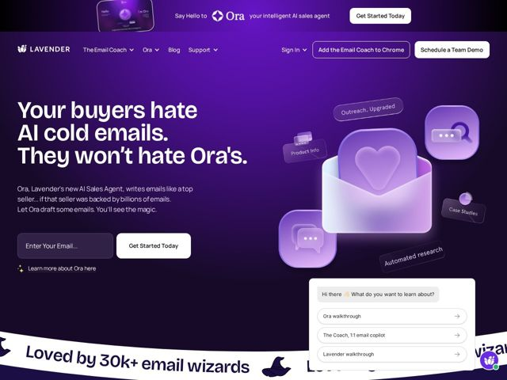

# Lavender — https://lavender.ai

- **niche:** ai-sales (email coaching / sales productivity)
- **mood:** bold-loud
- **style:** gradient, 3d, colorful, dark
- **palette:** bg `#3a1d8a` · ink `#ffffff` · accent `#b794f6` — lavender-purple glow on 3D email/heart icons, floating sticker labels, chat-prompt pills, and the gradient backdrop itself
- **type:** display *Grotesque/condensed-leaning geometric sans (heavy weight, tight tracking) — reads like a Druk/Founders Grotesk-style face* · body *Neutral humanist sans (Inter-like) for sub-copy and UI* — Loud and declarative up top, calm and functional below — a confident headline voice paired with quiet utility text
- **sections:** hero › feature-ora-agent › logos › how-it-works › feature-generative-ai › feature-security › newsletter-the-lavender-letter › community-lavenderland › certification-cta › footer
- **signature:** A full-bleed saturated purple gradient as the entire canvas (not a white SaaS page with purple accents) — the brand color IS the background, with chunky 3D claymorphic email/heart/chat icons and hand-drawn ribbon banners ("Loved by 30k+ email wizards") torn across the layout, leaning all-in on a playful "magic/wizard" theme instead of the sterile blue-on-white B2B-sales convention.
- **imagery:** Soft-shaded 3D claymorphic objects (open envelope with a glowing heart, rounded chat bubbles, magnifying glass) floating over the gradient, annotated with skeuomorphic "sticker" labels (Outreach Upgraded, Product Info, Case Studies, Automated research) and tilted ribbon/banner graphics. An inline chat-prompt mockup ("Hi there, What do you want to learn about?") doubles as a product demo. Wizard/magic motifs (hats) reinforce the playful brand.
- **copy:** Provocative, contrarian hero that names the buyer's pain and flips it — voice is cheeky, confident, anti-generic-AI; hero reads "Your buyers hate AI cold emails. They won't hate Ora's."

**Takeaways (steal as ideas, don't copy):**
- Make the brand color the full canvas, not an accent — a saturated gradient background reads as a confident point of view in a category drowning in blue-on-white.
- Use claymorphic 3D icons + skeuomorphic 'sticker' labels to annotate abstract product capabilities, turning a feature list into a tactile object scene.
- Lean a whole metaphor (wizards/magic) end-to-end — ribbon banners, hat icons, 'Email Wizard Certified', 'LavenderLand' — so personality compounds instead of being decorative.
- Open with a contrarian, buyer-side pain statement and resolve it in the same breath ('hate AI cold emails / won't hate Ora's') to earn attention before pitching.
