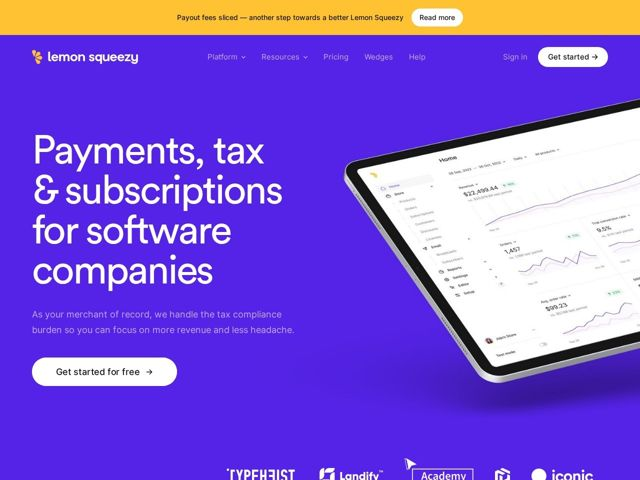

# Lemonsqueezy — https://lemonsqueezy.com

- **niche:** fintech
- **mood:** bold-loud
- **style:** colorful, minimal, 3d
- **palette:** bg `#5game` · ink `#FFFFFF` · accent `#F7C04A` — Promo announcement bar across the very top, the lemon logo mark, and small in-dashboard data accents; deliberately rationed so it pops against the saturated purple.
- **type:** display *JetBrains Mono* · body *JetBrains Mono* — Monospace, technical, founder-to-founder; mechanical letterforms made warm by huge scale and tight leading
- **sections:** hero › logos › feature-buying-experience › feature-marketing-tools › feature-analytics › feature-developers › testimonials › faq › cta › footer
- **signature:** A coding-monospace typeface (JetBrains Mono) blown up to massive display size for a fintech headline — the developer-tool font worn as a fashion statement, signaling "built by devs" before you read a word.
- **imagery:** Product-screenshot as hero: a real analytics dashboard floated on a tablet, dramatically tilted in 3D perspective and bleeding off the right edge so it reads as object-in-space rather than flat UI. Logo wall in monochrome white knockout below.
- **copy:** Plain-spoken benefit stack in the headline, reassuring sub-voice that names the pain. Hero H1: "Payments, tax & subscriptions for software companies"; subhead "As your merchant of record, we handle the tax compliance burden so you can focus on more revenue and less headache."

**Takeaways (steal as ideas, don't copy):**
- Pair one hyper-saturated brand color (electric indigo) covering ~90% of the viewport with a single warm accent rationed to the promo bar and logo — confidence through restraint, not a rainbow.
- Use a developer/monospace font as the DISPLAY face, not just for code blocks, when your audience is technical — it telegraphs credibility instantly.
- Tilt the product screenshot in 3D and let it bleed off-canvas so the hero feels like a physical object in space, giving depth without abstract 3D blobs.
- Stack the value prop as a literal noun list in the headline ('Payments, tax & subscriptions') so the offer is legible in under a second, then soften with an empathetic 'less headache' subhead.
