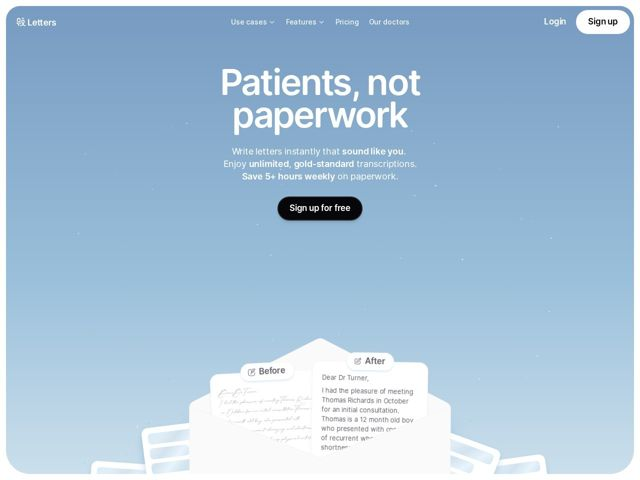

# Letters — https://letters.app

- **niche:** ai (medical documentation / healthtech — AI letter-writing for clinicians)
- **mood:** clean-light
- **style:** gradient, minimal, illustrated
- **palette:** bg `#7E9FC4` · ink `#FFFFFF` · accent `#000000` — pílula de CTA primária ("Sign up for free" e o "Sign up" da nav) renderizada como uma pílula arredondada preta sólida — o único elemento duro e saturado contra o suave gradiente de céu
- **type:** display *Geist / grotesca geométrica tipo Inter (peso pesado)* · body *mesma sans grotesca, peso regular com trechos seletivos em negrito* — confiante e humana — o título ultra-bold com tracking apertado soa declarativo, não clínico; as frases em negrito no subtítulo guiam o olhar como uma ênfase falada
- **sections:** hero › feature-before-after-demo › use-cases › features › pricing › our-doctors › cta › footer
- **signature:** Um gradiente full-bleed de céu diurno (lavanda esmaecendo para azul pálido) salpicado de tênues pontos de luz estelar — a página literalmente parece um céu aberto e calmo, o polo oposto da estéril convenção SaaS clínica de branco-e-turquesa. Software de saúde quase nunca deixa o fundo carregar todo o clima.
- **imagery:** Um único díptico hero de \"Before / After\" construído a partir de uma metáfora de carta-de-papel / envelope: um cartão acinzentado e ilegível com rabiscos manuscritos rotulado \"Before\" desliza atrás de uma carta clínica nítida e totalmente digitada rotulada \"After\", ambos emergindo de uma forma de envelope branco dobrado. O valor do produto (bagunçado → limpo) é mostrado como uma transformação física literal em vez de um screenshot de UI ou render 3D abstrato.
- **copy:** Voz orientada ao resultado e antiburocracia que promete tempo de volta; o hero diz "Patients, not paperwork" com um subtítulo que enfatiza cartas que "sound like you", saída "unlimited, gold-standard" e "Save 5+ hours weekly".

**Takeaways (roube como ideias, não copie):**
- Deixe o gradiente SER o design: uma única lavagem de céu calmante pode substituir ilustrações, fotografia e blocos de cor enquanto sinaliza o benefício emocional (calma, espaço para respirar) melhor do que copy de features.
- Demonstre o produto como um artefato físico de antes/depois (rabisco manuscrito virando uma carta limpa) em vez de um screenshot de UI — lê instantaneamente sem o espectador ter que decodificar uma interface.
- Use uma e apenas uma pílula de CTA preta como o único elemento de alto contraste numa paleta de resto suave, para que o olho tenha exatamente um lugar onde pousar.
- Combine um título ultra-bold de duas palavras ('Patients, not paperwork') com um subtítulo que coloca em negrito as frases que carregam o peso — os trechos de ênfase fazem a persuasão para que a frase possa permanecer curta.
