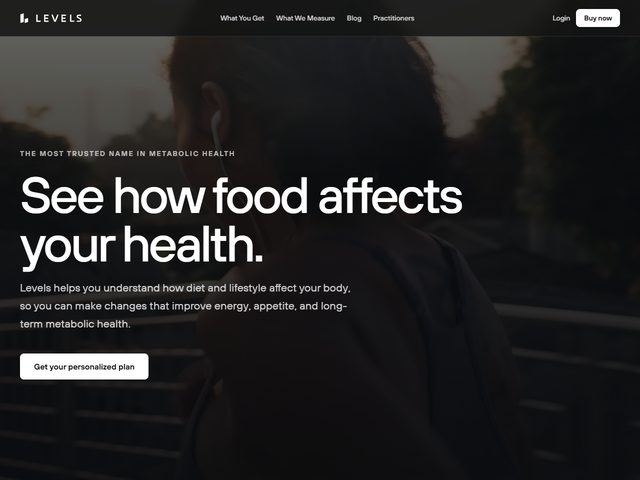

# Levels — https://www.levelshealth.com

- **niche:** health
- **mood:** editorial-minimal
- **style:** photographic, dark-overlay, editorial, serif-led
- **palette:** bg `#1A1714` · ink `#F5F3F0` · accent `#FFFFFF` — Não há acento cromático nenhum; o único "acento" é branco puro, usado para o wordmark, o título, a pílula de nav "Buy now" e a solitária pílula de CTA — a ênfase vem de um salto de brilho contra a foto quente-escura, não da cor.
- **type:** display *serifa editorial transicional (tipo Tiempos / Lyon), peso regular, muito grande com entrelinhamento apertado* · body *sans humanista (tipo Maison Neue / Söhne), cinza claro* — Calma, jornalística, quase de revista de bem-estar; a serifa fala e a sans recua.
- **sections:** hero › how-it-works › what-we-measure › cgm-product › outcomes-research › practitioners › testimonials › pricing › cta › footer
- **signature:** Toda a dobra é uma única fotografia de lifestyle dessaturada e fortemente escurecida (uma pessoa com mochila e fones caminhando, fotografada de costas/de lado) usada de borda a borda como o canvas, com um grande título em SERIFA de peso de livro disposto diretamente sobre ela — sem card, sem caixa de scrim em gradiente, sem UI de produto. Uma marca de saúde metabólica/CGM lê deliberadamente como um spread editorial estilo Kinfolk em vez de um dashboard de tech, apostando todo o hero em fotografia + contenção da serifa.
- **imagery:** Fotográfica full-bleed, de tons quentes e empurrada bem para o escuro para que o tipo branco permaneça legível sem uma caixa de overlay literal. Documental, espontânea, de escala humana — não é um product shot de estúdio, não é 3D, não é ilustração. A imagem sangra por baixo da nav escura transparente.
- **copy:** Segunda pessoa em linguagem direta e tranquilizadora. Sobrancelha em maiúsculas com tracking: "THE MOST TRUSTED NAME IN METABOLIC HEALTH"; título "See how food affects your health."; subtítulo "Levels helps you understand how diet and lifestyle affect your body, so you can make changes that improve energy, appetite, and long-term metabolic health." CTA: "Get your personalized plan".

**Takeaways (roube como ideias, não copie):**
- Carregue um hero inteiro em uma única foto full-bleed fortemente escurecida e coloque um grande título em serifa diretamente sobre ela — pule o card de scrim; deixe a própria escuridão da foto ser o contraste.
- Rode uma paleta sem cor: quase-preto quente mais branco, onde o único "acento" é um pop de brilho, para que a página soe editorial em vez de anunciada.
- Lidere uma categoria clínica/tech (CGM, dados metabólicos) com serifa estilo revista + fotografia de lifestyle para soar humana e confiável em vez de cara de dashboard.
- Enquadre o valor em linguagem de resultado simples em segunda pessoa ("See how food affects your health", "energy, appetite, long-term metabolic health") em vez de nomear o dispositivo ou a ciência.
