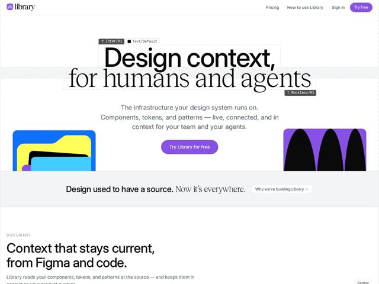

# Library — https://library.guide

- **niche:** design
- **mood:** editorial-minimal
- **style:** mono-type, minimal, colorful
- **palette:** bg `#FFFFFF` · ink `#0A0A0A` · accent `#8B5CF6` — Logo mark, primary CTA buttons ('Try free', 'Try Library for free'), and as a saturated block color inside the abstract folder/wave graphics. Used sparingly against an otherwise pure black-on-white page.
- **type:** display *Reckless (serif) paired with Inter (grotesque sans)* · body *Inter* — A deliberate two-voice headline: Inter set tight and heavy for the first line, Reckless's high-contrast editorial serif for the second — sans-meets-serif tension that signals 'design tooling' literally through type choice. Body is clean, neutral Inter.
- **sections:** hero › problem › feature-document › feature-* › how-it-works › pricing › cta › footer
- **signature:** The hero headline is annotated with real Figma layer/style badges — small monospace chips reading "Inter/H1", "Text/Default", and "Reckless/H1" hovering over the type, plus a faint selection bounding-box around the headline. The product literally inspects itself: the marketing copy is rendered as if it were a live component being read by the tool.
- **imagery:** Flat abstract vector graphics, not product screenshots. Bold geometric shapes — overlapping rounded 'folder/file' stacks in primary blue/yellow/cyan on the left, and a black scalloped wave on a purple field on the right. High-saturation, no gradients, no 3D; they read as design-token swatches made physical. Combined with the Figma-annotation overlay treatment on the hero text.
- **copy:** Confident, lineage-claiming voice that frames the product as design infrastructure for both people and AI. Hero: 'Design context, for humans and agents'; reinforced by 'Design used to have a source. Now it's everywhere.'

**Takeaways (steal as ideas, don't copy):**
- Mix two opposing typefaces WITHIN a single headline (heavy grotesque line 1, editorial serif line 2) to dramatize a 'two audiences / two worlds' message instead of stating it.
- Decorate marketing copy with the product's own UI chrome — here, Figma style-name badges and selection boxes over live text — so the hero doubles as a demo of what the tool does.
- Hold the page to strict black-on-white and spend the single purple accent only on the logo, CTAs, and one graphic block; let saturated primary-color vector art carry all the visual energy.
- Use a one-line italic-serif 'manifesto' band ('Design used to have a source. Now it's everywhere.') with an inline expandable 'Why we're building Library' toggle to add narrative without a full section.
