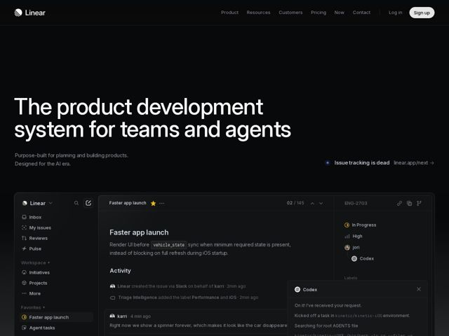

# Linear — https://linear.app

- **niche:** productivity
- **mood:** technical-dark
- **style:** dark, minimal
- **palette:** bg `#08090A` · ink `#F7F8F8` · accent `#5E6AD2` — Reserved almost entirely for the small status dot beside the 'Issue tracking is dead' link callout and product-UI state chips (the In Progress / status indicators). It is NOT used on the primary CTA — 'Sign up' is a plain white pill. The indigo functions as a quiet system-accent, not a marketing color.
- **type:** display *Inter / Inter Display (custom-tuned, near-identical to Linear's in-house 'Inter Variable' setup) — geometric grotesque set at large size with very tight tracking* · body *Inter — same family at regular weight, smaller, lower contrast gray* — Engineered, neutral, Swiss-precise; no warmth, no flourish — type as instrument, not voice
- **sections:** hero › feature-self-driving-ops › feature-product-direction › feature-cross-team-agents › feature-pr-agent-review › feature-progress-at-scale › changelog › cta › footer
- **signature:** The hero pairs a flat, oversized text headline with a pixel-perfect, fully-rendered replica of the actual Linear app UI (three-pane issue view, live agent 'Codex' chat bubble streaming a fake terminal command) — the product literally demos itself in the fold instead of using a static screenshot or abstract art. The interface IS the hero image.
- **imagery:** Product-screenshot, but built as live in-browser HTML/CSS recreations of the app rather than flat PNGs — dark-on-dark panels with hairline 1px borders, real micro-typography, status icons, and animated/streaming agent output. Treatment is hyper-literal and high-fidelity; zero illustration, zero 3D, zero gradient-mesh. The 'realness' of the UI is the entire visual argument.
- **copy:** Declarative category-defining statements in plain engineer-speak — hero reads 'The product development system for teams and agents' with the subhead 'Purpose-built for planning and building products. Designed for the AI era.' Section heads are verb-led capability claims ('Make product operations self-driving', 'Move work forward across teams and agents').

**Takeaways (steal as ideas, don't copy):**
- Demo the product in the fold by rebuilding its actual UI in HTML/CSS instead of dropping a screenshot — the live three-pane layout with a streaming agent chat bubble sells fidelity and speed in one glance.
- Decouple the accent color from the CTA: keep the marketing accent (indigo) as a tiny system/status signal and make the primary button plain white — it reads more like a tool, less like an ad.
- Set the hero headline huge with very tight tracking on a near-black (#08090A, not pure #000) canvas, and lean on a single hairline-bordered panel system so every feature section feels like a window into the app.
- Use a 'category is dead' provocation as a secondary inline link ('Issue tracking is dead → linear.app/next') to seed a narrative shift without cluttering the main value prop.
