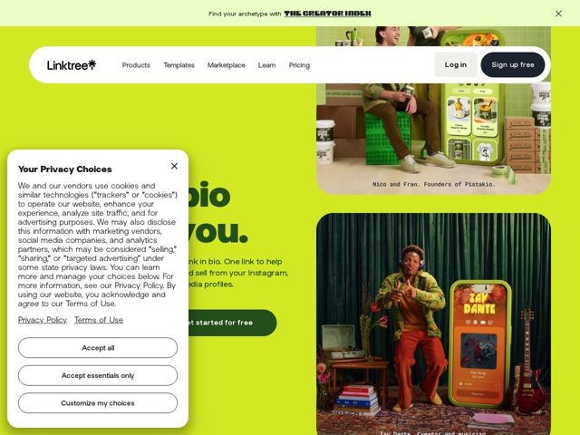

# Linktr — https://linktr.ee

- **niche:** consumer (creator tools / link-in-bio)
- **mood:** warm-playful
- **style:** colorful, photographic, illustrated
- **palette:** bg `#D2FF59` · ink `#1C4032` · accent `#254F1A` — botões de CTA primários em verde-escuro, a marca do logo em asterisco, a tinta do título e o botão 'Get started for free' sobre o campo lima
- **type:** display *Grotesca geométrica customizada (arredondada, 'o' e 'b' quase circulares, provavelmente uma face sob medida nomeada 'Yerk')* · body *Mesma família sans humanista em peso de texto* — Amigável, arredondada, confiante — energia de playground com contenção adulta; grandes títulos em minúsculas soam acessíveis, não corporativos
- **sections:** promo-banner › nav › hero › how-it-works (create/customize) › feature-share › feature-monetize › feature-analytics › social-proof (70M+ trusted) › value-prop › logos (as featured in) › testimonials › faq › cta › footer
- **signature:** O hero abandona inteiramente a convenção SaaS de screenshot-de-produto: em vez de um dashboard, inunda o quadro com retratos editoriais full-bleed de criadores reais e nomeados (Nico & Fran do Pistakio, Zay Dante) estilizados como um editorial de moda de revista — o produto aparece apenas como um celular nas mãos deles. Vende a pessoa, não a UI.
- **imagery:** Fotografia de lifestyle vibrante e dirigida artisticamente de criadores nomeados em cenários monocromáticos saturados (cortinas de veludo verde, caixotes lima), cada um segurando/ao lado de um celular superdimensionado renderizando seu Linktree real. Legendas reais nomeiam os retratados. Tratamento documental-encontra-editorial, caloroso e humano, zero stock ou UI vetorial.
- **copy:** Segunda pessoa, em linguagem direta e íntima — vende pertencimento sobre features. Hero: "A link in bio built for you." com subtítulo "One link to help you... sell from your Instagram... media profiles."

**Takeaways (roube como ideias, não copie):**
- Substitua o screenshot de produto do hero por retratos dirigidos artisticamente de usuários reais nomeados — mostre QUEM usa, não COMO se parece, e legende-os pelo nome para autenticidade.
- Comprometa-se firme com uma única cor de marca ultrassaturada (lima #D2FF59) como o canvas full-bleed, depois combine-a com um único verde-profundo para a tinta E os CTAs, de modo que a paleta tenha duas cores no total — a contenção radical lê como confiança.
- Use grandes títulos em minúsculas e grotesca arredondada em segunda pessoa ('built for you') para fazer uma ferramenta parecer um companheiro pessoal em vez de software corporativo.
- Deixe cada seção de feature dominar um mundo-foto saturado diferente (cortina verde, caixotes lima) para que rolar a página pareça folhear uma revista de moda, não ler uma lista de features.
