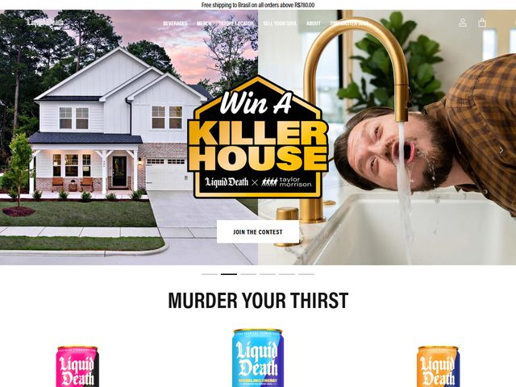

# Liquid Death — https://liquiddeath.com

- **niche:** food
- **mood:** bold-loud
- **style:** maximal, photographic, heavy-metal, irreverent
- **palette:** bg `#FFFFFF` · ink `#1A1A1A` · accent `#F2B233` — Um cromado dourado/amarelo barulhento reservado para o gigantesco lockup do badge "KILLER HOUSE"; todo o resto é tinta preta de alto contraste sobre branco puro, de modo que o badge dourado lê como um único ponto focal gritante contra uma página de resto limpa.
- **type:** display *blackletter/slab heavy-metal condensada (pense numa face customizada na linha da Trade Gothic Bold Condensed / um wordmark de banda de metal)* · body *sans geométrica limpa (Helvetica Now / Aktiv Grotesk)* — Swagger de lata tallboy; o título grita como um pôster de turnê, a nav sussurra numa sans arrumadinha.
- **sections:** hero › murder-your-thirst-product-grid › flavors-and-formats › brand-manifesto › merch › press-and-reviews › cta › footer
- **signature:** Um hero full-bleed de tela dividida em foto — casa-dos-sonhos suburbana e saudável à esquerda, um cara de camisa xadrez bebendo direto de uma torneira de cozinha dourada à direita — bissectado por um enorme badge dourado-e-cromado de sorteio "Win A KILLER HOUSE" co-marcado com a construtora Taylor Morrison. Toda a dobra é um takeover de sorteio em fotografia real encenado como uma capa de álbum de metal, não um beverage shot; o produto (latas) sequer aparece até você rolar para "MURDER YOUR THIRST."
- **imagery:** Fotografia de lifestyle real e ligeiramente espalhafatosa (casa ao pôr-do-sol em tons pastel, gole-na-torneira espontâneo) colada atrás de um badge-emblema em die-cut com biséis cromados e textura de metal desgastado — zero 3D, zero ilustração-pela-ilustração; o polimento está na confecção do badge, as fotos são deliberadamente ordinárias.
- **copy:** Voz de marca deadpan e violenta-engraçada que trata a água como death-metal — o badge do hero diz "Win A KILLER HOUSE" sobre um lockup de co-marca "Liquid Death × taylor morrison" com um botão "JOIN THE CONTEST"; o título da seção abaixo grita "MURDER YOUR THIRST", e a barra promocional no topo oferece "Free shipping on all orders above R$780.00."

**Takeaways (roube como ideias, não copie):**
- Faça da dobra uma campanha, não um product shot: entregue todo o hero a um takeover de sorteio/parceria e adie a revelação do produto até a segunda rolagem.
- Use uma composição de foto em tela dividida (aspiracional vs. absurdo) ponteada por um único badge em die-cut para carregar o título — o badge faz todo o trabalho tipográfico pesado.
- Coloque o acento barulhento em quarentena num único emblema dourado-cromado para que ele detone contra uma página de resto preto-no-branco em vez de competir por atenção.
- Deixe um lockup de co-marca ("× taylor morrison") sentar dentro do badge do hero para tomar credibilidade emprestada e sinalizar escala sem sair do título.
