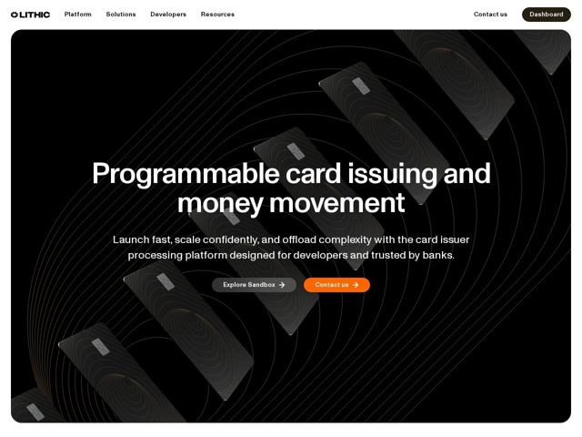

# Lithic — https://lithic.com

- **niche:** fintech
- **mood:** technical-dark
- **style:** dark, 3d, cinematic, mono-type
- **palette:** bg `#0A0A0A` · ink `#FFFFFF` · accent `#F26A1B` — pílula de CTA primária ('Contact us') e brilho de linha-de-circuito em relevo dentro dos cards flutuantes; usado com parcimônia como a única faísca calorosa contra um campo todo-preto
- **type:** display *Sans-serif grotesca (de largura aberta, 'g' de dois andares, sensação condensada — semelhante a uma grotesca customizada / estilo GT America ou Founders Grotesk)* · body *Sans-serif humanista (ligeiramente mais calorosa, legível, de menor contraste que a display)* — Engenhada e editorial — o título apertado e quase-condensado lê como branding aeroespacial ou de hardware, não como a amigabilidade arredondada típica de fintech
- **sections:** hero › logos › feature-reliability › feature-customization › feature-compliance › feature-settlements › how-it-works › testimonials › developer-cta › cta › footer
- **signature:** O hero é uma única cena 3D cinematográfica: uma cascata em espiral de cartões de crédito preto-fosco orbitando ao longo de arcos concêntricos gravados em circuito, iluminados apenas por tênues linhas de filamento laranja — transformando um produto de API abstrato em um único objeto físico que desafia a gravidade em vez da habitual colagem de screenshots de dashboard de fintech.
- **imagery:** Render 3D fotorrealista de cartões físicos idênticos preto-no-preto espiralando no espaço profundo, com linhas-guia concêntricas finíssimas e sutil iluminação de borda laranja traçando circuitaria. Monocromático, cor quase-zero, alto contraste — produto-como-escultura em vez de mockups de UI ou fotografia de stock.
- **copy:** Confiança de infraestrutura em linguagem direta com um quê irônico ("Payments are complex. Your programs don't need to be."); hero: "Programmable card issuing and money movement"

**Takeaways (roube como ideias, não copie):**
- Renderize seu produto abstrato/de API como UM objeto físico de hero no espaço preto-profundo — uma espiral de hardware repetido iluminada por uma única cor de acento lê como premium e tátil sem um único screenshot de UI
- Rode uma paleta quase-monocromática (preto + branco) e reserve UM acento caloroso (laranja) para exatamente duas coisas: a pílula de CTA primária e o brilho do produto — a escassez faz a faísca acertar
- Combine uma face de display grotesca apertada com um corpo humanista para sinalizar 'engenhado, não fofo' — escapa do default amigável-arredondado do branding de fintech
- Use motivos de linha-de-circuito concêntricos tanto como textura de fundo quanto como a fonte de iluminação para o objeto do hero, de modo que a decoração e o produto sejam visualmente um só sistema
