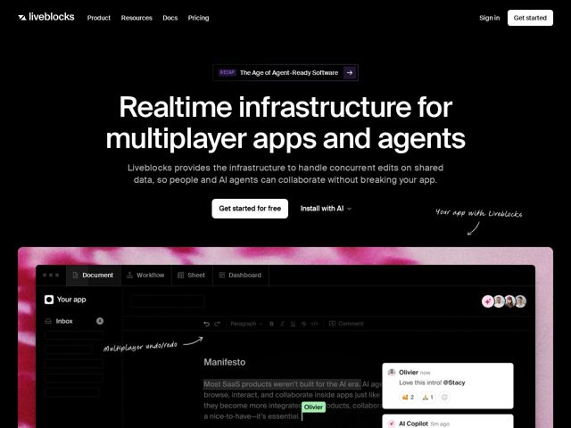

# Liveblocks — https://liveblocks.io

- **niche:** dev-tools / realtime-collaboration-infra
- **mood:** technical-dark
- **style:** dark, mono-type, photographic, bento
- **palette:** bg `#000000` · ink `#FFFFFF` · accent `#E8338A` — tie-dye magenta/rosa saturado sangra atrás do mockup de UI do produto e nos chips de avatar/comentário dentro do demo; o canvas escuro permanece preto puro para que o rosa leia como a única cor de hero
- **type:** display *Grotesca geométrica customizada (sans estilo Söhne/GT-America, 'a' de um andar, tracking apertado, peso pesado)* · body *Sans humanista-grotesca correspondente, peso regular, tamanho generoso* — Sans confiante de grau de engenharia — densa, superdimensionada e direta; lê como infraestrutura, não como marketing
- **sections:** hero › logos › feature-secret-sauce › feature-collaborative-ai › feature-grid-infra › feature-ready-to-ship › feature-developer-experience › feature-scale-trust › cta › footer
- **signature:** Anotações manuscritas em marcador branco com setas curvas ("Your app with Liveblocks", "Multiplayer undo/redo") rabiscadas diretamente sobre o screenshot do produto — uma camada de quadro-branco-de-designer apontando para a UI ao vivo, quebrando a estéril convenção de infra-escura com uma mão humana e esboçada.
- **imagery:** Um único mockup grande e ultrarrealista de UI de produto (um editor de documento multiplayer com cursores ao vivo, avatares de presença, comentários inline e uma thread de Copilot de IA) renderizado dentro de uma moldura de navegador, flutuando sobre uma suave lavagem rosa tie-dye/aurora. O conjunto real de features é mostrado como um app funcionando em vez de diagramas abstratos — mostre, não conte.
- **copy:** Enquadramento de infraestrutura em linguagem direta com um gancho da era da IA; o hero diz "Realtime infrastructure for multiplayer apps and agents" com um subtítulo prometendo que pessoas E agentes de IA podem colaborar "without breaking your app."

**Takeaways (roube como ideias, não copie):**
- Anote um screenshot de produto real com rótulos e setas desenhados à mão de marcador para ensinar as propostas de valor em contexto em vez de listas com marcadores
- Fixe a página inteira em preto puro, depois deixe UMA lavagem rosa saturada vazar de trás do mockup do hero para que a imagem do produto se torne a única fonte de cor
- Faça o demo do hero ser uma cena multiplayer realmente funcionando (cursores ao vivo, avatares de presença, threads de comentários, resposta de Copilot de IA) — o screenshot É o tour de features
- Um par de CTAs duplo combinando um botão primário com um dropdown 'Install with AI' sinaliza o público agent-native bem no hero
