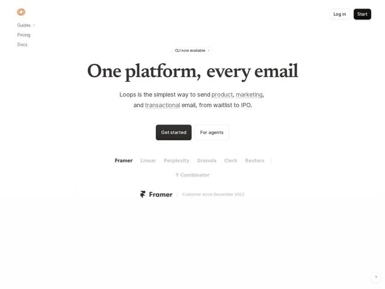

# Loops — https://loops.so

- **niche:** dev-tools
- **mood:** editorial-minimal
- **style:** minimal, mono-type, clean-light
- **palette:** bg `#FFFFFF` · ink `#2B2A28` · accent `#E2502A` — Apenas a marca do logo (o ícone de espiral laranja no canto superior esquerdo); todo o resto da página é tinta cinza-sobre-branco, fazendo o único acento caloroso funcionar como uma assinatura de marca em vez de uma cor de UI
- **type:** display *Uma serifa transicional de alto contraste (tipo Times/Georgia, ex. uma serifa de livro refinada) usada para o título superdimensionado do hero* · body *Uma sans-serif grotesca neutra (tipo Inter/Helvetica) para o subtexto, a nav e os botões* — Literário encontra engenhado. O título em serifa lê como um título de livro ou cabeçalho de revista enquanto o corpo em sans o mantém nítido e moderno. O par sinaliza bom gosto e contenção em vez de energia de template de startup.
- **sections:** hero › feature-email-design › feature-developer-experience › feature-lifecycle-workflows › feature-growth › feature-marketing-product-sync › feature-integrations › testimonials › cta › footer
- **signature:** Um título maciço em serifa de livro ("One platform, every email") centralizado em branco puro numa categoria — email/dev-tools — que tem como default a sans geométrica pesada e a arte de hero em gradiente. Trocar a esperada sans SaaS por uma serifa editorial e remover toda a imagery do hero é a jogada que quebra o gênero.
- **imagery:** Imagery decorativa quase-zero acima da dobra. Composição puramente tipográfica: texto sobre branco. Os únicos elementos gráficos são a marca do logo em espiral laranja e uma fileira de wordmarks de clientes em escala de cinza (Framer, Linear, Perplexity, Granola, Clerk, Reuters, Y Combinator). Um pequeno card rotativo de "Customer since" ancora a parede de logos. O tratamento é plano, de muito espaço em branco, zero sombra ou gradiente.
- **copy:** Frase de impacto confiante e em linguagem direta com um subtítulo de palavra-chave sublinhada; o hero diz "One platform, every email" / "Loops is the simplest way to send product, marketing, and transactional email, from waitlist to IPO."

**Takeaways (roube como ideias, não copie):**
- Use UM acento caloroso apenas para o logo e rode a página inteira em escala de cinza — a escassez faz a cor de marca parecer premium em vez de decorativa.
- Combine um título superdimensionado em serifa editorial com um corpo em sans neutra para quebrar a monocultura sans-do-SaaS e sinalizar bom gosto.
- Sublinhe inline os três substantivos do produto (product, marketing, transactional) dentro do subtítulo para que a proposta de valor também funcione como um mapa de features navegável.
- Ancore a parede de logos com um micro-card rotativo de 'Customer since [data]' — ele converte uma faixa de confiança estática em prova viva e específica.
