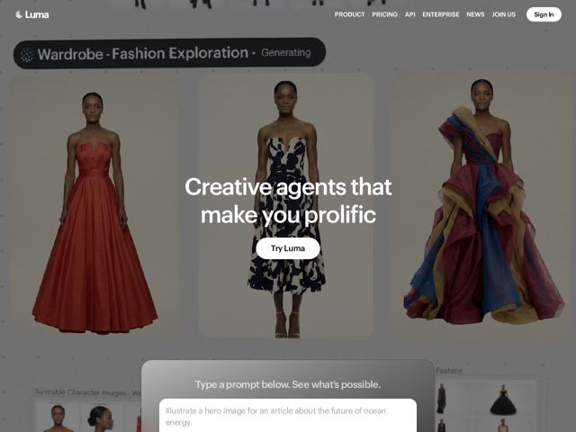

# Lumalabs — https://lumalabs.ai

- **niche:** ai
- **mood:** premium-luxe
- **style:** photographic, cinematic, minimal
- **palette:** bg `#E9E3DA` · ink `#FFFFFF` · accent `#C0392B` — carried entirely by the fashion photography itself — the rust-red couture gown and jewel-toned dresses act as the accent, not a UI color
- **type:** display *Rounded humanist sans (Luma's geometric-rounded brand face, akin to a softened Circular/SF Rounded)* · body *Same rounded sans family, lighter weight* — Soft, warm, approachable-premium — the rounded terminals undercut the cold-tech default of AI brands and read more like a luxury fashion house than a model lab
- **sections:** hero › feature-prompt-input › feature-product-platform › feature-research › news › team-community › footer
- **signature:** The entire hero IS a live product demo dressed as an editorial fashion shoot: a 'Generating…' status pill sits above three full-bleth couture model shots, so the page proves the product (image generation) by being the artifact, with zero diagram, dashboard, or screenshot-of-a-UI.
- **imagery:** Full-bleed, magazine-grade generated fashion photography — three runway models in couture gowns on a warm putty backdrop, plus a turntable character grid and a fashion contact-sheet bleeding in below. Treatment is photoreal and gallery-lit; the AI output is presented as finished creative work, never as a tech sample.
- **copy:** Aspirational benefit-as-identity, not feature-listing — names the user's transformation. Hero: "Creative agents that make you prolific."

**Takeaways (steal as ideas, don't copy):**
- Make your hero the product's OUTPUT at full editorial quality, not a UI screenshot — let the artifact carry the proof.
- Use a literal 'Generating…' status pill floating over the work to imply liveness and motion without an actual video.
- Drop a real, usable prompt box ('Type a prompt below. See what's possible.') directly in the hero so the page is the demo — try-before-signup with zero friction.
- Borrow luxury-fashion art direction (warm putty bg, couture subjects, rounded warm type) to escape the cold blue/dark-mode AI cliché entirely.
