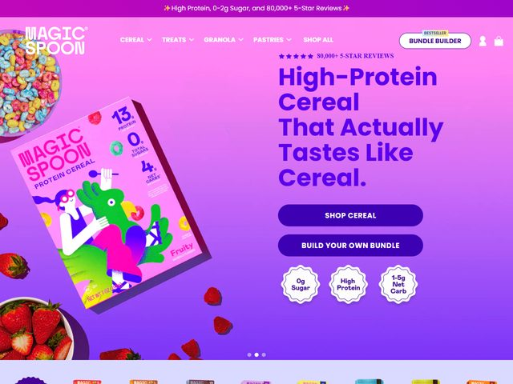

# Magic Spoon — https://magicspoon.com

- **niche:** food
- **mood:** bold-loud
- **style:** vibrant, retro-pop, candy-bright, illustrated
- **palette:** bg `#A93FD6` · ink `#3A1AC4` · accent `#E84BC9` — A magenta-to-violet gradient floods the entire fold; the hot-pink accent lives in the product box, the colorful cereal photography, and the top announcement bar, so the whole canvas reads as one saturated candy wash rather than a single highlight color.
- **type:** display *rounded geometric sans (Sharp Grotesk Rounded / Recoleta-adjacent, ultra-bold, tight stacked lines)* · body *clean grotesque (Founders Grotesque / Aktiv Grotesk)* — Loud, chunky, confident; the headline shouts like a cereal box, not a tech deck.
- **sections:** hero › benefit-stats (protein/sugar/carbs) › flavor-lineup › nutrition-comparison-vs-legacy-cereal › reviews-social-proof › build-your-own-bundle › cta › footer
- **signature:** The hero stages an actual tilted cereal box — a vivid character-illustrated "Magic Spoon Protein Cereal, Fruity" carton — floating mid-air with real strawberries, raspberries, and bowls of rainbow cereal scattered across a glowing purple-pink gradient. Nutrition call-outs (13g protein, 0g sugar, 4g net carbs) sit as overlaid badge bubbles right on the box, and three scalloped sticker-coins repeat the claims under the CTAs. It's packaging-as-hero: the product photography IS the visual, blasted in maximum saturation.
- **imagery:** Glossy product photography (the physical box) layered over flat character illustration on the carton itself, plus styled food props (berries, full cereal bowls) and die-cut scalloped badge stickers. No 3D render, no whitespace — everything is bright, propped, and overflowing.
- **copy:** Plain-spoken and cheeky, leaning hard on the better-for-you hook — headline "High-Protein Cereal That Actually Tastes Like Cereal." with the eyebrow "★★★★★ 80,000+ 5-STAR REVIEWS" and a top bar reading "✨ High Protein, 0-2g Sugar, and 80,000+ 5-Star Reviews ✨". CTAs: "SHOP CEREAL" and "BUILD YOUR OWN BUNDLE".

**Takeaways (steal as ideas, don't copy):**
- Make the literal retail package the hero: tilt the box, float it, and let its own illustration carry the brand instead of a separate art direction.
- Stamp nutrition proof points as scalloped sticker-coins (0g Sugar / High Protein / 1-5g Net Carb) sitting directly under the CTA — claims as physical badges, not bullet lists.
- Flood the whole fold with one saturated gradient and prop real food into it so the page feels like a candy aisle, not a website.
- Lead the headline with a contrarian relief promise ("...That Actually Tastes Like Cereal") that names the category's usual disappointment, then defuse it.
