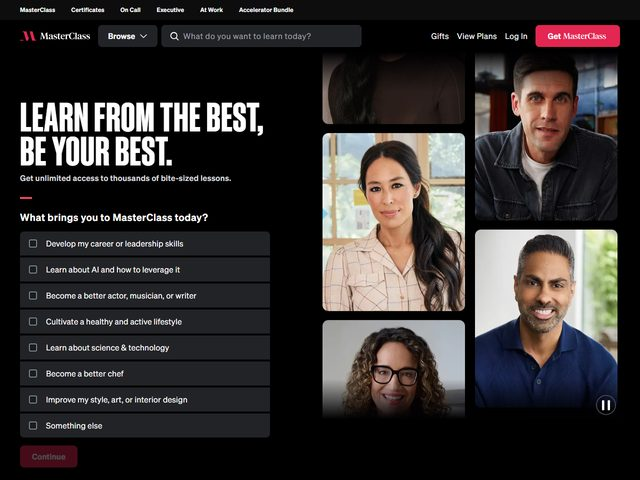

# MasterClass — https://www.masterclass.com

- **niche:** education
- **mood:** bold-loud
- **style:** dark, condensed, photographic, editorial
- **palette:** bg `#0A0A0A` · ink `#FFFFFF` · accent `#E50914` — The hot Netflix-style red is rationed to the top-right "Get MasterClass" CTA pill and a single short underline rule beneath the subhead; everything else is white-on-black, so the red reads as the one "press here" signal on the whole fold.
- **type:** display *condensed grotesque, all-caps, ultra-bold (Druk Wide / Founders Grotesk Condensed feel)* · body *clean humanist sans (GT America / Proxima Nova)* — Headline shouts like a movie poster; body and quiz labels drop to a calm, quiet sans.
- **sections:** hero › category-rails › featured-instructors › how-it-works › testimonials › pricing › cta › footer
- **signature:** Instead of one hero shot, the right two-thirds is a tiled mosaic of instructor face portraits — six warm, cinematically-lit headshots packed edge-to-edge in offset rectangles, with a single video play/pause control floating in the bottom-right corner so the grid plays as muted footage. The left third turns the fold into an onboarding quiz: a card titled "What brings you to MasterClass today?" with eight checkbox rows ("Develop my career or leadership skills", "Learn about AI and how to leverage it", "Become a better chef"…) and a red "Continue" button — the page interviews you before it sells you.
- **imagery:** Photographic only — premium, color-graded portrait photography of real instructors against soft domestic/studio backgrounds, cropped tight on the face. No illustration, no 3D, no product UI. The faces themselves are the value proposition.
- **copy:** Aspirational, two-beat command voice. Headline: "LEARN FROM THE BEST, BE YOUR BEST." Subhead: "Get unlimited access to thousands of bite-sized lessons." Quiz prompt: "What brings you to MasterClass today?" Top nav even uses the search field as a pitch — placeholder "What do you want to learn today?"

**Takeaways (steal as ideas, don't copy):**
- Replace the static hero image with a packed mosaic of human faces and a single play control, so the fold reads as living footage of who you'd be learning from.
- Embed an onboarding quiz directly in the hero (checkbox intent picker + Continue) so the first interaction segments the visitor instead of just describing the product.
- Ration a single saturated red to exactly two marks — the signup pill and one underline rule — against pure white-on-black to make the CTA unmissable.
- Pair a movie-poster condensed all-caps headline ("LEARN FROM THE BEST, BE YOUR BEST.") with quiet humanist-sans body for theatrical contrast.
