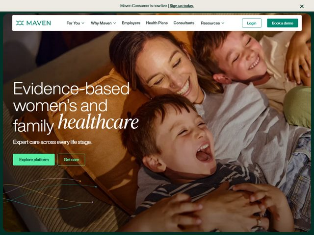

# Maven — https://www.mavenclinic.com

- **niche:** health
- **mood:** warm-playful
- **style:** photographic, warm, editorial, lifestyle
- **palette:** bg `#1E3A2F` · ink `#FFFFFF` · accent `#2E9E6B` — Deep forest-green frames the whole hero as a border and tints the photo's shadow side; the brighter spring-green carries the primary "Explore platform" pill and the top-right "Book a demo" button, so the same hue plays both calm backdrop and call-to-action.
- **type:** display *humanist sans (Aktiv Grotesk / GT Walsheim) with one word set in a contrasting italic serif (Tiempos / Canela)* · body *matching humanist sans, regular weight* — Friendly and editorial; the lone italic "healthcare" softens an otherwise clinical sans into something maternal.
- **sections:** hero › trust-logos › for-individuals › for-employers › programs-grid › outcomes-stats › testimonials › cta › footer
- **signature:** A single word — "healthcare" — is swapped from the clean sans into a flowing italic serif, mid-headline, turning a credentialed phrase ("Evidence-based women's and family") warm and human exactly on the word that matters. It rides over a full-bleed candid photo of a mom belly-laughing with two kids on a couch in golden light, so the clinical claim and the emotional payoff occupy the same frame. Thin curved line-art "data flow" strokes with tiny node-dots trail across the lower-left corner, quietly signalling the tech/platform underneath the cozy scene.
- **imagery:** Full-bleed warm lifestyle photography — real family, candid joy, warm tungsten/golden grade with deep green shadows. No 3D, no illustration except the delicate curved vector flow-lines and dots overlaid bottom-left as a subtle "platform" motif. The photo is staged to feel snapshot-genuine, not stock-posed.
- **copy:** Reassuring, plain-spoken, credibility-first. Announcement bar: "Maven Consumer is now live. | Sign up today." Headline: "Evidence-based women's and family *healthcare*" with subhead "Expert care across every life stage." CTAs read "Explore platform" and "Get care."

**Takeaways (steal as ideas, don't copy):**
- Set one load-bearing word of an otherwise clinical headline in a contrasting italic serif to humanize the whole line without softening the credibility claim.
- Frame the entire hero in a thin colored border drawn from the brand's deep accent — it makes a full-bleed photo feel composed and "framed" rather than just laid behind text.
- Pull the same green into both the marketing CTA and the photo's shadow grade so the call-to-action feels native to the image, not stuck on top of it.
- Overlay faint curved line-art with node dots on a warm human photo to hint at the tech platform underneath without breaking the emotional tone.
