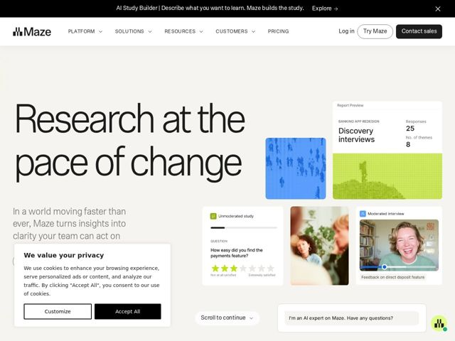

# Maze — https://maze.co

- **niche:** design (user research / UX testing platform)
- **mood:** editorial-minimal
- **style:** minimal, editorial, photographic, colorful
- **palette:** bg `#FFFFFF` · ink `#1A1A1A` · accent `#3B6BF5` — data-viz tiles (the cobalt-blue pixelated crowd image), the 'Try Maze' outline button, and small UI state chips inside product cards; chartreuse-green (#C4E03A) is a secondary accent in the second report tile
- **type:** display *Large-x-height grotesque, near GT Walsheim / Aeonik-style geometric sans set at oversized weight* · body *Same humanist/grotesque sans family, regular weight, slightly italic-leaning in the subhead* — Confident editorial newspaper-headline feel — huge tight-leading display type does the heavy lifting; calm, unfussy, magazine-like rather than techy
- **sections:** hero › feature-recruit-research-analyze › feature-versatility › feature-scale › feature-influence › feature-ai › logos › report-cta › trust-security › cta › footer
- **signature:** The hero headline is set newspaper-huge (spanning nearly the full column at a magazine masthead scale) with the product UI demoted to small scattered card 'specimens' on the right — inverting the SaaS convention where a giant product screenshot dominates and the headline is a polite supporting line. Type is the hero, the app is the garnish.
- **imagery:** A loose collage of asymmetric rounded-corner cards: real product-UI snippets (unmoderated study, moderated interview with a live webcam still of a smiling participant), warm candid lifestyle photos of real people, and abstract pixelated data-mosaic tiles (a cobalt crowd, a chartreuse terrain). Mixes literal product proof, human warmth, and abstract data texture instead of a single polished dashboard shot.
- **copy:** Editorial, change-maker voice that frames research as momentum, not tooling — hero: "Research at the pace of change" with subhead "In a world moving faster than ever, Maze turns insights into clarity your team can act on".

**Takeaways (steal as ideas, don't copy):**
- Let oversized newspaper-scale display type be the hero and shrink the product UI into small scattered 'specimen' cards around it — flips the giant-screenshot default.
- Build the hero collage from three deliberately different image registers (abstract data-mosaic tiles, real human webcam/lifestyle photos, literal product chrome) so one frame proves data + humanity + product at once.
- Use a restrained near-mono palette and let a single saturated accent (cobalt) live only inside the data-viz tiles, so color reads as 'this is the data' rather than decoration.
- Theme feature sections as a repeated 'Research needs X' rhetorical drumbeat (versatility / scale / influence) to turn a feature list into an argument.
