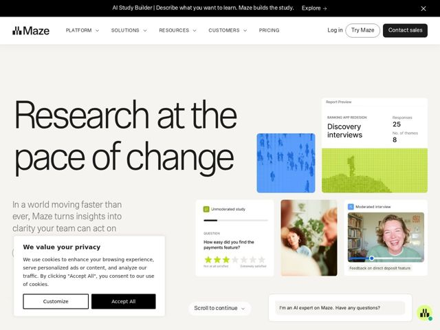

# Maze — https://maze.design

- **niche:** design (user research & testing platform)
- **mood:** editorial-minimal
- **style:** minimal, editorial-minimal, photographic
- **palette:** bg `#FFFFFF` · ink `#1A1A1A` · accent `#C6F042` — data-viz tiles (lime heatmap), the floating chat avatar badge, and small product-UI highlights — never on primary CTAs, which stay black
- **type:** display *Grotesque sans-serif (tight, near-condensed — reads like a custom Maze grotesque / GT-style face)* · body *Humanist sans-serif (italic in the subhead for editorial warmth)* — Confident newspaper-masthead scale meets soft humanist body; the giant tight-tracked headline does the talking while the italic subhead adds a magazine byline feel
- **sections:** announcement-bar › hero › feature-recruit › feature-research › feature-analyze › feature-versatility › feature-scale › feature-influence › feature-ai › logos › feature-security › cta › footer
- **signature:** A massive, tightly-tracked editorial headline ("Research at the pace of change") that fills nearly half the viewport — set against an asymmetric collage of real interview webcam stills and pixel-style data heatmaps, breaking the sterile dashboard-screenshot convention of research/dev tools with a human, magazine-cover composition.
- **imagery:** Asymmetric bento collage mixing three registers: candid photographic webcam stills of real interview participants (warm, human), abstract pixelated/dithered heatmap tiles in cobalt blue and lime green (data-as-texture), and clipped product-UI snippets (report previews, satisfaction-star questions). No glossy renders — everything feels captured rather than illustrated.
- **copy:** Big-idea editorial declarative — names the tension, not the feature; hero reads "Research at the pace of change" with italic subhead "In a world moving faster than ever, Maze turns insights into clarity your team can act on."

**Takeaways (steal as ideas, don't copy):**
- Let one oversized, tight-tracked headline carry the whole hero — drop it to ~half-viewport scale and pair it with a small italic subhead for a magazine-masthead hierarchy.
- Use a reserved acid-lime accent ONLY inside data-viz and product chrome, keeping primary CTAs monochrome black — the accent reads as 'the product's color', not 'a button color'.
- Mix imagery registers in one bento: real webcam/participant photos for humanity + dithered pixel heatmaps for the data layer, so a research tool feels human instead of clinical.
- Anchor the section rhythm on a repeated noun-phrase cadence ('Research needs versatility / scale / influence') so feature blocks read as a manifesto, not a checklist.
