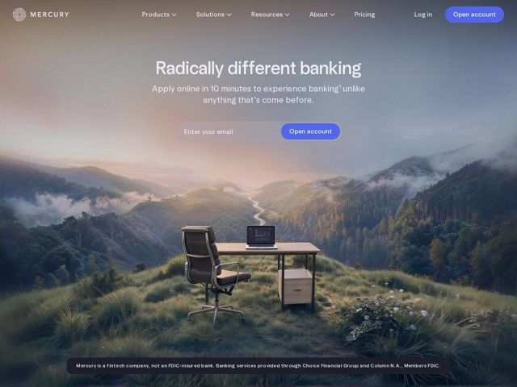

# Mercury — https://mercury.com

- **niche:** fintech
- **mood:** premium-luxe
- **style:** photographic, cinematic, minimal, gradient
- **palette:** bg `#D9C4B8` · ink `#FFFFFF` · accent `#5B6CFF` — pílulas de CTA "Open account" (cabeçalho + botão do formulário do hero) e o botão principal 'Open account'; a única cor saturada numa cena de resto contida e naturalista
- **type:** display *sans estilo Söhne / grotesk (grande, apertada, de baixo contraste)* · body *Mesma grotesque humanista em peso mais leve* — Calma, confiante, moderna-discreta; sem serifas decorativas, sem firula — a contenção é a declaração
- **sections:** hero › logos › problem › feature-revenue-proof › feature-funding-proof › feature-award-proof › how-it-works › feature-business › feature-personal › cta › footer
- **signature:** Uma foto de paisagem cinematográfica em página inteira — um vale de floresta enevoado na golden hour com uma única mesa de escritório, cadeira e laptop plantados num cume gramado — substitui o hero de screenshot-de-dashboard que toda fintech adota por padrão. Banco é vendido como serenidade e vista, não como números e UI.
- **imagery:** Uma única cena fotorrealista dominando o hero: névoa atmosférica suave, cristas de montanha em camadas, céu em gradiente quente de rosa-empoeirado para sálvia. Um posicionamento de produto surreal (a mesa solitária no meio do mato) carrega a metáfora da marca em vez de qualquer screenshot. A UI está visivelmente ausente acima da dobra.
- **copy:** Afirmação ousada e de fala simples que compra briga com a categoria — hero: "Radically different banking" / sub: "Apply online in 10 minutes to experience banking unlike anything that's come before."

**Takeaways (roube como ideias, não copie):**
- Comece com uma vista fotográfica e emocional em vez de um dashboard de produto — deixe uma única imagem cinematográfica carregar todo o clima e reserve a UI para as seções mais abaixo.
- Restrinja a saturação a um único acento periwinkle, para que o único azul da página seja o CTA — o olho vai direto para 'Open account.'
- Embuta o campo de captura de e-mail diretamente no hero como uma pílula (input + botão de acento), para que a ação principal de conversão viva acima da dobra, sem rolagem.
- Sequencie a prova social como manchetes H2 autônomas ('$650M in annual revenue', 'Series C', 'Most Innovative'), transformando a credibilidade em uma espinha narrativa em vez de uma faixa de logos.
