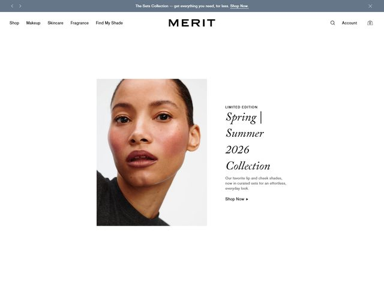

# MERIT — https://www.meritbeauty.com

- **niche:** beauty
- **mood:** editorial-minimal
- **style:** minimal, photographic, editorial, off-white
- **palette:** bg `#FFFFFF` · ink `#1A1A1A` · accent `#9AA7B2` — Não há nenhuma cor de marketing; o único elemento não neutro é a barra de anúncio azul-ardósia bem no topo, e até o CTA "Shop Now ▸" é texto preto simples + uma minúscula seta, sem preenchimento de botão. A contenção É o sinal da marca.
- **type:** display *serif editorial itálica de alto contraste (Didone, à la Canela / GT Sectra Display Italic)* · body *grotesque humanista (à la Söhne / Akkurat), minúscula e cinza* — Voz de masthead de revista de moda sobre um corpo em sans quase anônimo.
- **sections:** hero › shop-by-category › bestsellers › find-my-shade-quiz › press-quotes › refill-sustainability › cta › footer
- **signature:** O título "Spring | Summer 2026 Collection" é diagramado em uma serif itálica grande, inclinada e de alto contraste — empilhado em quatro linhas, alinhado à esquerda com borda irregular à direita, com um literal pipe `|` embutido no wordmark como se fosse o título de uma temporada de passarela de uma casa de moda, não um lançamento de beauty. Combinado com um retrato em enquadramento fechado, de pele nua, no-makeup-makeup, que preenche um retângulo branco limpo flutuando em espaço negativo, toda a dobra é lida como a capa de uma revista trimestral impressa em vez de um hero de e-commerce.
- **imagery:** Uma única fotografia editorial — um retrato em close-up extremo, luz do dia suave, textura de pele e sardas visíveis, top cinza neutro, olhos para a câmera. Sem brilho de retoque, sem frasco de produto no quadro, sem 3D. O produto é implicado inteiramente pela pele "iluminada por dentro" da modelo.
- **copy:** Luxo silencioso, sem pontos de exclamação. Sobretítulo "LIMITED EDITION", título "Spring | Summer 2026 Collection", subtítulo "Our favorite lip and cheek shades, now in curated sets for an effortless, everyday look." CTA "Shop Now ▸". Barra de anúncio no topo: "The Sets Collection — get everything you need, for less. Shop Now."

**Takeaways (roube como ideias, não copie):**
- Empreste o enquadramento de passarela de moda "Season Year Collection" para um lançamento de produto, para sinalizar instantaneamente gosto editorial em vez de comércio movido a desconto.
- Mate o botão: faça o CTA principal ser texto puro de tinta + uma seta de espessura mínima, para que a dobra seja lida como uma revista, não como uma loja.
- Flutue um retângulo de foto de bordas limpas em amplo espaço branco em vez de um fundo de página inteira — a própria margem se torna o sinal de luxo.
- Combine um título Didone itálico, inclinado e de alto contraste com um corpo em sans cinza minúsculo e anônimo para obter tensão entre glamour e neutralidade clínica.
