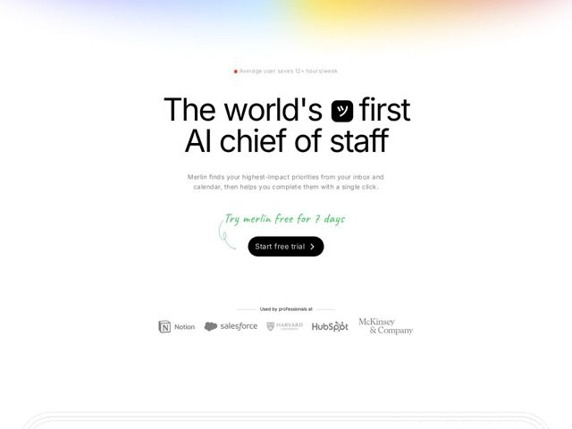

# Merlin — https://merlin.computer

- **niche:** ai
- **mood:** clean-light
- **style:** minimal, mono-type, illustrated
- **palette:** bg `#FFFFFF` · ink `#111111` · accent `#3DBE5A` — handwritten 'Try merlin free for 7 days' script + hand-drawn arrow looping into the black CTA button; tiny red status dot in the eyebrow stat
- **type:** display *Inter* · body *Inter* — Massive, tightly-tracked Inter at near-headline-grotesk scale — neutral system-grade type pushed to billboard size so the words, not the typeface, carry the swagger. Restrained body at a calm reading size.
- **sections:** hero › logos
- **signature:** An inline logo glyph (rounded black app icon with a katakana 'ツ' face) dropped mid-sentence into the headline — the product literally interrupts its own tagline, plus a green felt-tip handwritten promise that hand-draws an arrow into the CTA, breaking the sterile all-white AI-tool convention with human, analog warmth.
- **imagery:** Near-zero photography. A soft full-bleed rainbow-gradient wash bleeds down from the top edge into pure white (aurora at the masthead, then nothing). Logo-as-typography: the app icon sits inline in the H1. Hand-drawn marker accents (script label + curved arrow). Faint architectural line-work begins emerging at the bottom fold. Grayscale customer wordmarks (Notion, Salesforce, Harvard, HubSpot, McKinsey) for restraint.
- **copy:** Bold category-claim voice — declarative and a little cheeky: "The world's [icon] first AI chief of staff" with a quantified eyebrow ("Average user saves 12+ hours/week") and a handwritten "Try merlin free for 7 days" doing the persuasion the button can't.

**Takeaways (steal as ideas, don't copy):**
- Embed your product icon inline inside the H1 so the logo becomes a word — the brand interrupts its own sentence instead of sitting in a corner.
- Pair one analog, hand-drawn accent (green marker script + a curved arrow pointing into the CTA) against an otherwise clinical white layout for instant human warmth and click-direction.
- Lead with a quantified outcome eyebrow ('saves 12+ hours/week' with a live red dot) above the headline so the benefit lands before the claim.
- Let a single top-edge rainbow aurora gradient fade to pure white carry all the color, keeping 95% of the page negative space and centered.
