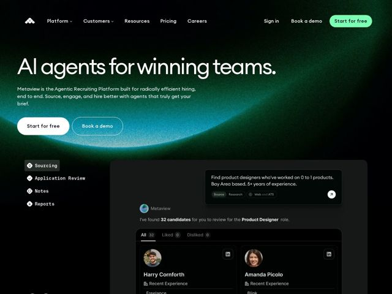

# Metaview — https://metaview.ai

- **niche:** ai recruiting / hr-tech (agentic SaaS)
- **mood:** technical-dark
- **style:** dark, gradient, cinematic
- **palette:** bg `#0A1410` · ink `#F4F7F4` · accent `#5AF0A0` — pílula de CTA principal (Start for free), brilho atmosférico verde de horizonte atrás do hero, pequenos chips inline de status/tag na UI do produto
- **type:** display *Georgia* · body *Inter* — Título em serif editorial em escala gigante posto contra um corpo em grotesque neutra e limpa — um tom literário, confiante, quase de masthead de jornal, que parece humano contra um produto construído por máquina
- **sections:** hero › logos › feature-overview › feature-agents › how-it-works › feature-security › testimonials › feature-roadmap › pricing › faq › cta › footer
- **signature:** Um horizonte de buraco-negro / planetário: o hero fica sobre uma esfera escura com uma luminosa borda atmosférica verde de rim-light curvando-se pelo terço inferior, como se você estivesse olhando para a borda de um planeta ao amanhecer — escala celestial fazendo as vezes de "IA que vê tudo", em vez do hero de gradiente roxo chapado que toda SaaS de IA adota por padrão.
- **imagery:** Pano de fundo cinematográfico de gradiente de espaço escuro com uma única fonte de luz verde curva; o primeiro plano é um painel realista de UI de produto embutido (card de vidro escuro) mostrando o fluxo de sourcing real — cards de candidatos com fotos reais, tags de source/research, uma mensagem de agente. Produto-como-herói, com iluminação que parece fotografada em vez de ilustração abstrata.
- **copy:** Título de manifesto em serif ousado, de fala simples e codificado em esporte/time ("AI agents for winning teams."); o subtítulo é concreto e denso em benefício ("the Agentic Recruiting Platform built for radically efficient hiring, end to end"), com uma voz recorrente de humano-vs-labuta ("Agents that love the tasks you hate").

**Takeaways (roube como ideias, não copie):**
- Coloque um enorme título editorial em SERIF (Georgia) sobre um pano de fundo escuro e tech — o contraste serif/escuro é lido como premium e humano, quebrando o clichê de sans-sobre-gradiente da IA.
- Use uma única luz atmosférica curva (brilho de borda planetária) como toda a composição do hero em vez de gradientes agitados — uma única fonte de luz faz mais trabalho do que dez.
- Embuta a UI literal e funcional do produto (cards de candidatos, fotos reais, chat de agente) logo abaixo da dobra, para que a afirmação abstrata de 'agente de IA' fique instantaneamente concreta.
- Reserve um único verde-neon de alta croma para UM único CTA principal e deixe o resto permanecer escuro quase monocromático — a escassez do acento torna o botão magnético.
