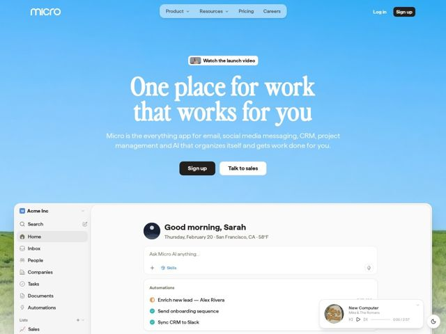

# Micro — https://micro.so

- **niche:** productivity
- **mood:** clean-light
- **style:** editorial-minimal, gradient, photographic
- **palette:** bg `#7FB9EE` · ink `#FFFFFF` · accent `#221F1C` — near-black pill buttons (Sign up), the wordmark, and product-UI chrome that sits on the white app screenshot below the fold
- **type:** display *High-contrast transitional/Didone serif (Times-like ditalic-feel, e.g. Canela / Tiempos / Times-style)* · body *Humanist geometric sans-serif (e.g. Aeonik / GT Walsheim / Circular-like)* — Literary, warm authority meets soft modern utility — the serif romanticizes a category (everything-app) that normally screams in bold sans.
- **sections:** nav › hero › video-badge › subhead › cta › product-screenshot › music-player-widget
- **signature:** A full-bleed photographic sky-to-grass-field gradient as the hero background — a real landscape horizon, not a UI mesh — so an enterprise everything-app feels like open air instead of a dashboard. The white product window then docks into the grass like the horizon line itself.
- **imagery:** Real photographic environment: a sky-blue gradient at top dissolving into a soft-focus green meadow at the fold, used as ambient backdrop. Floating glass UI chips (Watch the launch video badge, a now-playing music widget bottom-right) layer over it. The hero hands off to a large, realistic in-app product screenshot showing an AI home screen ("Good morning, Sarah"), CRM sidebar, and automation feed — selling breadth through fidelity rather than abstract illustration.
- **copy:** Warm second-person promise in an oversized serif: "One place for work that works for you" — aspirational and human, with a plainspoken sub that lists the breadth (email, social, CRM, PM, AI) so the romance is backed by specifics.

**Takeaways (steal as ideas, don't copy):**
- Swap the obligatory UI-mesh/grid hero for a literal photographic horizon (sky-to-field) — instant calm, instant differentiation in a crowded SaaS category.
- Set the hero headline in a large high-contrast editorial serif while keeping body + buttons in a neutral sans; the type contrast alone reads premium and un-templated.
- Dock the product screenshot so its top edge aligns with the photo's horizon line — the app appears to grow out of the landscape instead of floating in a generic device frame.
- Add an off-brand ambient detail (a now-playing music widget) to make the page feel like a lived-in workspace, not a marketing render.
