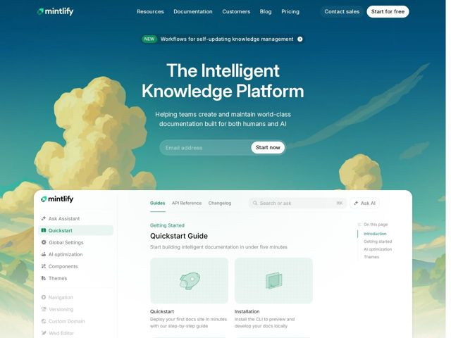

# Mintlify — https://mintlify.com

- **niche:** dev-tools
- **mood:** clean-light
- **style:** gradient, illustrated, minimal
- **palette:** bg `#2E7D8E` · ink `#FFFFFF` · accent `#16A34A` — marca do logo, badge em pílula 'NEW', item ativo da barra lateral, destaques de link/título no mockup de docs embutido, destaques das nuvens ilustradas
- **type:** display *Sans humanista geométrica (Aeonik / grotesque estilo GT)* · body *Mesma família, peso mais leve* — Suave, arredondada, confiante — amigável-técnica em vez de afiada-de-engenharia. O grande título display de tracking apertado é lido como editorial, não como terminal.
- **sections:** hero › feature-built-for-the-intelligence-age › logos › feature-people-and-ai › feature-self-updating-knowledge › feature-enterprise-knowledge › testimonial-anthropic-case-study › cta › footer
- **signature:** Uma paisagem de céu-e-nuvens pictórica, ilustrada à mão, como fundo de página inteira do hero — cenário atmosférico de belas-artes onde sites de ferramentas-dev adotam por padrão grades, terminais ou código. A UI do produto então 'flutua' de baixo para cima dentro desse céu como um horizonte.
- **imagery:** Ilustração suave em aquarela/guache de nuvens cúmulos sobre um céu em gradiente de turquesa-para-azul, com um screenshot real de produto (o editor de docs com barra lateral à esquerda, abas e 'Ask AI') sobrepondo-se à borda inferior, de modo que o chrome quebra o limite do hero. Dentro do mockup, ilustrações pontuais de line-art em verde monocromático ficam em cards de placeholder de grade pontilhada.
- **copy:** Voz calma e declarativa de afirmação de categoria — nomeia a plataforma, não a funcionalidade. Hero: "The Intelligent Knowledge Platform" / sub: "Helping teams create and maintain world-class documentation built for both humans and AI."

**Takeaways (roube como ideias, não copie):**
- Substitua o obrigatório hero de código/terminal por ilustração atmosférica pictórica — um céu em gradiente em vez de uma IDE escura diferencia instantaneamente uma ferramenta-dev.
- Deixe o screenshot ao vivo do produto sobrepor e quebrar a borda inferior do hero, para que a UI suba como uma linha do horizonte, fundindo cenário e software.
- Combine um input de captura de e-mail diretamente com um único CTA em pílula dentro do hero, mas mantenha um 'Start for free' separado na navegação — duas rampas de entrada, uma sem atrito.
- Use um único verde saturado como o único acento numa paleta de resto tonal turquesa — confine-o ao logo, a uma pílula 'NEW' e ao estado ativo de doc, para que seja lido como marca, não decoração.
