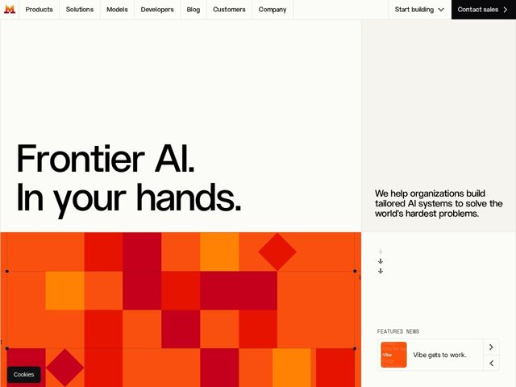

# Mistral — https://mistral.ai

- **niche:** ai
- **mood:** bold-loud
- **style:** bold, colorful, mono-type
- **palette:** bg `#FAFAF5` · ink `#0A0A0A` · accent `#FA5111` — bloco de mosaico de pixels em página inteira de laranjas/vermelhos/carmesim preenchendo a parte inferior do hero; minúscula marca da marca; o botão 'Contact sales' é preto invertido
- **type:** display *Grotesque sans (pesada, quase estilo Helvetica/Neue Haas) disposta ultragrande* · body *Mesma família grotesque em peso regular; micro-rótulos ALL-CAPS em estilo mono (FEATURED NEWS)* — Neutralidade de nível de engenharia escalada a tamanho monumental; a fonte permanece simples para que o TAMANHO e a cor façam todo o grito
- **sections:** hero › feature-products › feature-solutions › problem-why › footer-legal
- **signature:** O hero é dividido: enorme título preto calmo sobre quase-branco em cima, e um MOSAICO DE GRADE DE PIXELS tremeluzente em página inteira de tons de fogo (quadrados laranja/vermelho/carmesim + losangos inclinados) embaixo — uma homepage de IA que usa uma tapeçaria retrô de baixa resolução em vez do obrigatório orbe de gradiente, malha neural ou render 3D.
- **imagery:** Sem fotografia, sem 3D abstrato. Um mosaico generativo de tiles de quadrados quentes e saturados e acentos de losangos rotacionados, lido como uma bandeira de 8 bits ou mapa térmico; finas guias técnicas de espessura mínima/marcas de registro sobrepostas sugerem um blueprint de design system. Um pequeno card de notícia em encaixe fica numa barra lateral limpa.
- **copy:** Soco declarativo de três palavras com sabor de soberania — o hero diz literalmente "Frontier AI. In your hands." com o subtítulo "We help organizations build tailored AI systems to solve the world's hardest problems."

**Takeaways (roube como ideias, não copie):**
- Divida o hero entre um topo tipográfico quieto e uma base ruidosa de arte generativa em página inteira, para que o bloco de cor carregue a energia em vez das palavras.
- Construa a imagem da marca a partir do DNA do seu logo — o mosaico de pixels da Mistral ecoa sua marca tricolor em blocos, fazendo a arte parecer inevitável em vez de decorativa.
- Combine títulos monumentais em grotesque neutra com minúsculos rótulos mono ALL-CAPS (FEATURED NEWS) para um registro de documento de engenharia.
- Use um fundo de papel off-white #FAFAF5 + tinta preta pura, para que um único acento laranja-fogo seja lido como maximamente ruidoso sem um gradiente.
