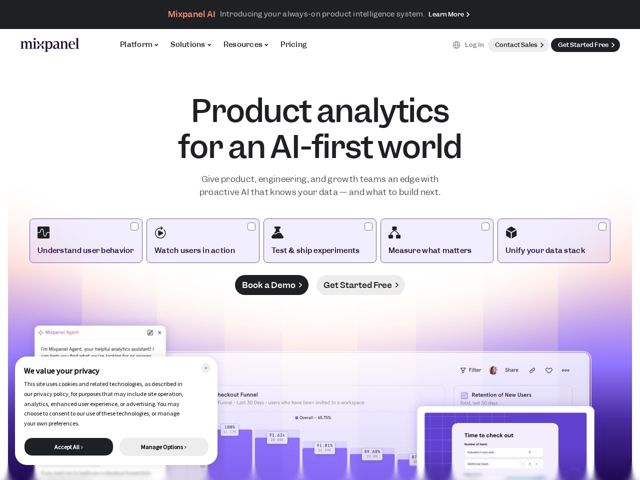

# Mixpanel — https://mixpanel.com

- **niche:** analytics
- **mood:** clean-light
- **style:** minimal, gradient, bento
- **palette:** bg `#FFFFFF` · ink `#1A1A1A` · accent `#B79DF0` — soft lilac-to-peach gradient wash behind the hero product UI, pastel-tinted feature category cards, and the dashboard chrome
- **type:** display *geometric grotesque (Mixpanel custom / GT-style sans, near-Söhne with circular bowls)* · body *humanist sans (matching grotesque at lighter weight)* — Confident and editorial-tech: oversized tight-tracked display sets a magazine-cover tone, while the body stays calm and small, so the page feels authored rather than templated.
- **sections:** announcement-bar › hero › feature-category-cards › dual-cta › product-ui-showcase › feature-ai-intelligence › why-choose-us › metrics › enterprise › journey-support › cta › footer
- **signature:** A row of five selectable, checkbox-tipped category cards sits directly under the hero — turning the value-prop list into an interactive product-configurator the visitor can literally tick, instead of the usual static three-column feature grid.
- **imagery:** Real, hyper-detailed product screenshots (funnels, retention charts, billing modal, an AI agent chat) staged at a slight 3D perspective tilt and floating on a soft pastel gradient, layered so multiple UI panels overlap to suggest depth and a living dashboard rather than a flat marketing mock.
- **copy:** Plain-spoken, outcome-first declarative voice that names the audience and the moment — hero reads "Product analytics for an AI-first world".

**Takeaways (steal as ideas, don't copy):**
- Make the hero feature list tappable: pastel cards with a tiny icon + checkbox read as a config you can interact with, not a static benefit grid.
- Float overlapping real-UI screenshots on a pastel gradient at a slight perspective tilt to telegraph product depth without a hero illustration.
- Pair two CTAs of differing commitment ('Book a Demo' solid dark vs 'Get Started Free' soft pill) so high- and low-intent visitors both have an obvious next step.
- Let an oversized, tightly-tracked grotesque headline carry the whole top of the page over a near-white background — restraint everywhere else makes the type the hero.
