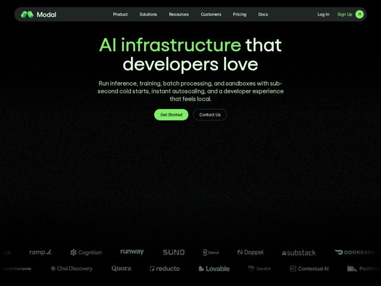

# Modal — https://modal.com

- **niche:** ai-infra / dev-tools (serverless GPU compute)
- **mood:** technical-dark
- **style:** dark, minimal, mono-type, gradient
- **palette:** bg `#0A0A0A` · ink `#EDEFE9` · accent `#7CF77C` — first half of the h1 ('AI infrastructure'), primary 'Get Started' pill button, logomark, 'Sign Up' nav text + round arrow chip
- **type:** display *Geometric grotesque sans (low-contrast, near-circular bowls — reads like a custom/GT-style grotesk)* · body *Same humanist-grotesque family, lighter weight* — Engineered, calm, and approachable — rounded terminals soften an otherwise utilitarian infra tone, the opposite of cold monospace SRE clichés
- **sections:** nav › hero › logos › feature-product-cloud › feature-build-systems › feature-inference › feature-training › feature-agents › feature-global-gpu › feature-security › social-proof-teams › showcase-built-with › cta › footer
- **signature:** The split-color headline: the literal product category ("AI infrastructure") is set in electric green while the emotional payload ("that developers love") stays white — the accent highlights the boring noun, not the verb, making infra itself feel desirable. Paired with a near-empty black hero where the fold is mostly negative space, letting type + one green pill carry the whole frame.
- **imagery:** Almost no decorative imagery above the fold — a subtle film-grain/noise texture over pure black does the atmospheric work. Visual interest is deferred to a dual-row monochrome customer logo wall (Ramp, Cognition, Runway, Suno, Substack, DoorDash, Quora, Lovable, Contextual AI, PostHog) rendered in muted gray so it reads as texture, not clutter. Lower sections (per headings) pivot to a code-as-hero / live-demo "Built with Modal" gallery.
- **copy:** Confident, benefit-first dev voice — names the hard primitives plainly. Hero: "AI infrastructure that developers love" / sub: "Run inference, training, batch processing, and sandboxes with sub-second cold starts, instant autoscaling, and a developer experience that feels local."

**Takeaways (steal as ideas, don't copy):**
- Two-tone headline: paint the category noun in your accent and leave the emotional clause white — sell the unsexy thing by making it glow.
- Earn restraint: a pure-black hero with one neon pill and ~60% empty space reads as confidence, not laziness — let one accent do all the work.
- Mute your logo wall to gray so prestige brands act as ambient texture and don't fight the headline for attention.
- Sub-headline as a spec list ('sub-second cold starts, instant autoscaling, feels local') front-loads the three benefits engineers actually evaluate.
