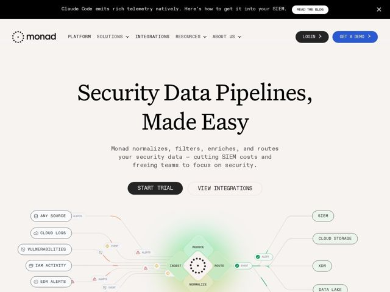

# Monad — https://monad.com

- **niche:** security
- **mood:** clean-light
- **style:** minimal, mono-type, illustrated
- **palette:** bg `#FFFFFF` · ink `#1A1A1A` · accent `#2E7D5B` — pílulas de nó em verde-sálvia apagado e tags de status 'EVENT/ALERT' no diagrama do pipeline, mais um brilho verde sutil no núcleo do diagrama; azul reservado apenas para o botão 'Get a Demo'
- **type:** display *Serifa transicional de alto contraste (tipo Times/Georgia) no H1* · body *Monoespaçada (estilo IBM Plex Mono / Roboto Mono) para nav, subtítulo, botões e todos os rótulos de UI* — Editorial encontra terminal: um headline em serifa literária por cima de uma interface toda monoespaçada — lê como um paper de pesquisa renderizado num editor de código
- **sections:** announcement-bar › hero › how-it-works › feature-managed-pipelines › feature-in-flight-transforms › feature-rule-based-routing › feature-deploy-your-way › feature-integrations › why-us › how-it-works-steps › faq › cta › footer
- **signature:** Um esquema de pipeline ao vivo, com cara de desenhado à mão, como peça central do hero: as pílulas de origem na coluna esquerda fluem por um diamante central INGEST/REDUCE/NORMALIZE/ROUTE até as pílulas de destino na coluna direita, com tags animadas de alerta/evento viajando pelos fios — o fluxo de dados do produto É a ilustração do hero, não um screenshot ou gráfico abstrato.
- **imagery:** Arte de linha diagramática: fios conectores finos em cinza ligando nós retangulares arredondados em "pílula" com ícones-glifo minúsculos inline. Um hub central de círculo pontilhado girando com um suave brilho radial verde. Micro-tags de status (ALERTS, EVENT, ALERT) em verde/âmbar pousam sobre os fios como pacotes em trânsito. Sem fotografia, sem pessoas, sem 3D — puramente esquemático, funcional, quase como um quadro branco de arquitetura limpo.
- **copy:** Headline de benefício em linguagem direta numa serifa literária, seguido de um subtítulo mono com verbos empilhados — "Security Data Pipelines, Made Easy" / "Monad normalizes, filters, enriches, and routes your security data — cutting SIEM costs and freeing teams to focus on security."

**Takeaways (roube como ideias, não copie):**
- Combine um headline em serifa editorial séria com uma UI toda monoespaçada — a tensão de gênero (literária vs terminal) sinaliza 'rigoroso mas humano' melhor do que mais uma página dev toda sans.
- Faça a ilustração do hero ser a topologia real do produto: origens -> núcleo de transformação -> destinos, com tags de pacotes em movimento, para que a proposta de valor seja entendida antes de qualquer texto ser lido.
- Use um verde-sálvia dessaturado (não um verde-ciber neon) como única cor, aplicado com parcimônia a pílulas de status e a um único brilho no núcleo — a contenção lê como 'confiança enterprise' num nicho de segurança cheio de dashboards escuros.
- Reserve uma segunda cor (azul) para exatamente um CTA para criar uma ação primária clara sem um sistema de botões barulhento.
