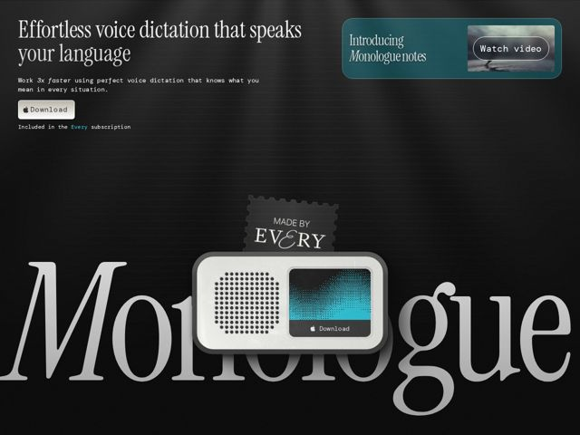

# Monologue — https://monologue.to

- **niche:** dev-tools
- **mood:** technical-dark
- **style:** dark, editorial, 3d, mono-type
- **palette:** bg `#171717` · ink `#EDEDEB` · accent `#2BB6C4` — cyan device screen glow, the teal 'Introducing' card, and an inline 'Every' link in body copy
- **type:** display *High-contrast serif (Times-like / transitional roman, e.g. Times New Roman or a refined Caslon)* · body *Monospace (typewriter-style mono for sub-copy and labels)* — Literary newspaper masthead meets terminal printout: erudite serif headlines paired with a deliberately mechanical mono voice
- **sections:** hero › feature-shortest-distance › feature-notes › feature-speaks-your-language
- **signature:** A photoreal 3D retro-radio / hardware gadget renders the product as a physical object that breaks the giant serif 'Monologue' wordmark, treating a voice app like a tangible vintage device instead of a flat UI screenshot.
- **imagery:** Cinematic dark scene: oversized serif wordmark bleeding off the bottom edge as a backdrop, a glossy skeuomorphic 3D speaker/dictation device with a glowing cyan dithered screen sitting on top, plus a postage-stamp 'MADE BY EVERY' badge. Subtle vignette and soft top light; muted blurry video thumbnail in the announcement card.
- **copy:** Confident benefit-first claim in elegant serif, quantified and plain-spoken: hero reads 'Effortless voice dictation that speaks your language' with mono subcopy 'Work 3x faster using perfect voice dictation that knows what you mean in every situation.'

**Takeaways (steal as ideas, don't copy):**
- Pair a high-contrast literary serif headline with monospace body copy to signal 'crafted but technical' without any UI chrome
- Render the product as a tangible 3D object (retro hardware) and let it physically overlap a huge background wordmark for depth and memorability
- Use a single saturated cyan only on the device's glowing screen + one announcement card, so the accent reads as emitted light against near-black
- Anchor credibility with a tiny stamp/seal badge ('MADE BY EVERY') instead of a generic logo row
