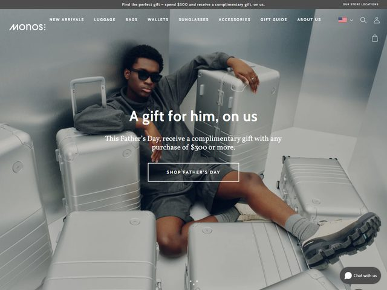

# Monos — https://monos.com

- **niche:** travel
- **mood:** premium-luxe
- **style:** minimal, photographic, monochrome, editorial
- **palette:** bg `#A9ACB0` · ink `#F4F5F6` · accent `#5C6166` — Não há cor de marketing alguma; toda a primeira dobra é uma escala de cinza tonal de malas de alumínio e paredes de concreto. O único "destaque" é o tom castanho quente das solas dos sapatos da modelo e o balão laranja "Chat with us" — todo o resto é deliberadamente dessaturado para que o produto prata fosco leia como o hero.
- **type:** display *serifa editorial de alto contraste, à la Canela / Tiempos Headline (itálico verdadeiro, generoso, em branco)* · body *serifa humanista em corpo pequeno, mesma família* — Discreta, boutique, ponderada; a tipografia sussurra em vez de vender.
- **sections:** hero › gift-guide-grid › best-sellers › material-story › reviews › newsletter-cta › footer
- **signature:** O hero inteiro é uma única fotografia editorial de moda — uma modelo em cinza monocromático reclinada *dentro* de um ninho de malas rígidas prateadas da marca, fotografada num cômodo de concreto cinza frio para que o produto e o cenário se tornem um único campo tonal. Em vez de isolar uma mala no branco, a bagagem é encenada como mobília/ambiente, e o headline em serifa branca fica centralizado sobre a imagem como uma chamada de capa de revista. O produto envolve o humano em vez de o humano segurar o produto.
- **imagery:** Fotografia de lifestyle em full-bleed, tratamento editorial/lookbook. Gradação fria e dessaturada, luz natural suave, malas de alumínio fosco dispostas num espalhamento deliberado. Sem 3D, sem ilustração, sem UI — apenas uma foto estilizada fazendo todo o trabalho.
- **copy:** Voz calorosa de ocasião de presente em serifa centralizada. Headline: "A gift for him, on us". Subtítulo: "This Father's Day, receive a complimentary gift with any purchase of $300 or more." Pílula de CTA (contorno fantasma): "SHOP FATHER'S DAY". Barra promo no topo: "Find the perfect gift — spend $300 and receive a complimentary gift, on us."

**Takeaways (roube como ideias, não copie):**
- Encene o produto como ambiente: cerque um humano com os produtos (bagagem como mobília) em vez de uma foto-hero isolada e limpa — vende lifestyle e escala ao mesmo tempo.
- Trave toda a primeira dobra numa única paleta tonal (a própria cor do material do produto) para que a foto leia premium e coesa, com zero de cor de marca adicionada.
- Use um CTA de contorno fantasma sobre a fotografia — uma pílula fina com borda branca mantém a imagem dominante e lê mais boutique do que um botão de cor sólida.
- Rode uma oferta sazonal de presente numa barra fina no topo E repita-a no subtítulo do hero, para que o mesmo incentivo emoldure a página sem poluir o headline.
