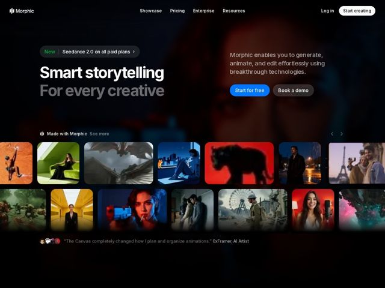

# Morphic — https://morphic.com

- **niche:** ai
- **mood:** technical-dark
- **style:** dark, cinematic, bento, photographic
- **palette:** bg `#0A0B0D` · ink `#FFFFFF` · accent `#2D7FF9` — primary 'Start for free' CTA pill and the small 'New' tag in the announcement chip; everything else is white/grey on near-black
- **type:** display *Geometric grotesque sans (Inter/SF-like, heavy weight)* · body *Same grotesque sans, regular weight* — Confident and clean; the headline leans on weight contrast (solid white line over a dimmed grey line) rather than a decorative typeface to create drama
- **sections:** nav › hero › announcement-chip › feature-gallery › testimonial
- **signature:** The hero copy is pushed to a narrow left column while a sprawling two-row carousel of actual AI-generated film stills becomes the real hero — the product output IS the visual, so the page reads like a streaming-service shelf rather than a typical centered SaaS hero with a UI screenshot.
- **imagery:** Wall-to-wall cinematic AI-generated frames — climbers, dragons, noir city scenes, portraits, the Eiffel Tower, war scenes — in saturated, film-graded color, each a rounded card. A faint moody portrait bleeds behind the headline for atmosphere. Imagery does all the persuading; there are no UI screenshots or diagrams.
- **copy:** Aspirational two-line value statement with weight-contrast emphasis; voice is creative-empowering, not technical. Hero: "Smart storytelling / For every creative."

**Takeaways (steal as ideas, don't copy):**
- Split the hero: keep a tight text column on the left and let a horizontally-scrolling shelf of real outputs occupy 60%+ of the fold — proof-by-portfolio instead of a UI mockup.
- Build drama with weight, not color: a solid-white line stacked over a dimmed-grey second line gives a single sans-serif headline a cinematic two-tone hierarchy.
- Drop a single embedded testimonial right under the gallery with stacked avatars and a creator handle ('0xFramer, AI Artist') to anchor credibility in the target community without a full section.
- Reserve one bright accent (electric blue) for exactly one primary CTA against an otherwise monochrome dark canvas so the conversion path is unmissable.
