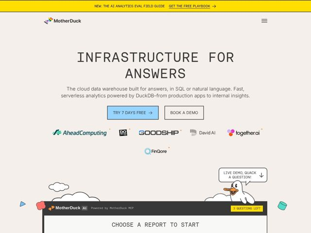

# Motherduck — https://motherduck.com

- **niche:** data-tools
- **mood:** warm-playful
- **style:** mono-type, illustrated, colorful
- **palette:** bg `#F2EDE6` · ink `#1A1A1A` · accent `#FFE800` — barra de anúncio no topo em largura total; azul secundário (#9FD2F2) preenchendo o botão de CTA principal
- **type:** display *Monoespaçada (mono geométrica, caráter JetBrains/IBM-Plex-Mono), tudo em caixa-alta, espaçamento largo entre letras* · body *Inter* — O terminal de um engenheiro encontra um livro de histórias infantil — o headline em mono caixa-alta lê como um prompt de CLI, enquanto o papel creme quente e um pato de desenho suavizam a aresta técnica
- **sections:** announcement-bar › hero › logos › feature-book-offer › feature-warehouse-ai › audience › use-cases › how-it-works › ecosystem › cta-community › newsletter › footer
- **signature:** Um widget de demo de analytics com IA ao vivo na página, ancorado à base do hero ("CHOOSE A REPORT TO START" / "3 QUESTIONS LEFT"), onde um pato de desenho à mão literalmente flutua para cima numa nuvem e aponta para um balão de fala dizendo "LIVE DEMO, QUACK A QUESTION!" — o mascote está funcionalmente ligado ao trial do produto, não é decorativo.
- **imagery:** Ilustrações de desenho estilo marcador feitas à mão (um mascote pato branco, nuvens com contorno fofo, um avião de papel, formas primitivas flutuantes — cubo, triângulo, mancha) espalhadas soltas por um canvas creme quente. O mural de logos é monocromático em escala de cinza com minúsculos detalhes de ponto laranja. Estética deliberadamente de baixa fidelidade, de caderno de esboços, que rejeita a norma de 3D-gradiente polido dos sites de infra de dados.
- **copy:** Direta, declarativa, levemente herética para a categoria — lidera com o benefício, não com a tecnologia. Hero: "INFRASTRUCTURE FOR ANSWERS"; o subtítulo reformula um data warehouse em torno de respostas em linguagem natural ("built for answers, in SQL or natural language").

**Takeaways (roube como ideias, não copie):**
- Coloque um headline em monoespaçada estilo CLI em CAIXA-ALTA sobre papel creme quente em vez de branco frio — lê instantaneamente como 'feito por engenheiros' sem um único screenshot de UI.
- Conecte seu mascote ao produto: não estacione um desenho no canto, faça-o gesticular em direção a uma demo interativa ao vivo embutida no hero para que o lúdico faça trabalho real de conversão.
- Use um único destaque berrante de alta saturação (amarelo-táxi) numa única faixa full-bleed bem no topo, depois fique quase monocromático em todo o resto — a contenção faz a única cor bater mais forte.
- Reformule o substantivo de categoria commodity ('data warehouse') como um resultado humano no H1 ('Answers') — venda o resultado, relegue a tecnologia (DuckDB) ao subtítulo.
