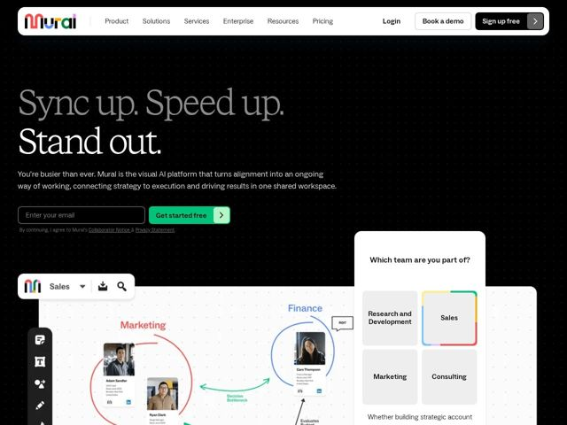

# Mural — https://mural.co

- **niche:** productivity
- **mood:** technical-dark
- **style:** dark, editorial, colorful
- **palette:** bg `#0A0A0A` · ink `#FFFFFF` · accent `#3DDC97` — preenchimento do botão de CTA principal ('Get started free' / chevron 'Sign up free'), mais um conjunto de destaques multicoloridos arco-íris (vermelho/amarelo/verde/azul) reservado para o logo da Mural e os traços do diagrama dentro do canvas
- **type:** display *Serifa (serifa transicional de alto contraste, estilo GT Sectra / Tiempos)* · body *Sans-serif neo-grotesca (estilo Inter / Helvetica Now)* — Confiança editorial encontra clareza utilitária — um headline em serifa literária carrega a emoção enquanto uma sans neutra mantém o texto do produto nítido e confiável
- **sections:** hero › logos › feature-vision › results-proof › feature-ai-workflows › feature-team-outcomes › solutions › transformation › testimonials › blog-insights › release-notes › pricing-sizes › cta › footer
- **signature:** Um headline serifado em dois tons onde a primeira metade ('Sync up. Speed up.') fica em cinza apagado e o desfecho ('Stand out.') estala em branco brilhante na linha de baixo — usando contraste de valor, não de tamanho, para entregar a virada retórica. Uma serifa literária num canvas quase-preto é uma ruptura deliberada com a convenção de sans plana em modo claro da categoria de quadro branco/colaboração.
- **imagery:** Um screenshot ao vivo e flutuante do canvas do produto sangra de baixo para cima — mapas mentais em estilo desenhado à mão com traços conectores vermelhos/azuis/verdes, cards de persona reais em estilo LinkedIn (fotos de rosto, nomes, cargos) e clusters de departamentos codificados por cor (Marketing, Finance). Sobreposto no canto superior direito há um card interativo branco arredondado 'Which team are you part of?' com blocos selecionáveis, mesclando UI real com um quiz de personalização para fazer o hero parecer o próprio app.
- **copy:** Slogan imperativo direto em três tempos com voz de serifa editorial; o hero diz 'Sync up. Speed up. Stand out.' seguido de um subtítulo empático 'You're busier than ever' posicionando a Mural como a 'visual AI platform.'

**Takeaways (roube como ideias, não copie):**
- Divida um headline em preparação apagada + desfecho branco brilhante em linhas separadas — deixe o contraste de valor (cinza para branco), e não o tamanho da fonte, carregar o clímax.
- Combine uma display de serifa literária de alto contraste com um corpo grotesco neutro num canvas quase-preto para parecer editorial e premium mantendo legibilidade no texto do produto.
- Embuta um widget de personalização interativo ('Which team are you part of?') diretamente no hero para que o primeiro scroll já pareça usar o produto, e direcione visitantes a valor sob medida.
- Mantenha o chrome da UI monocromático (só o verde-CTA branco), mas reserve um destaque arco-íris completo estritamente para o logo e os traços ao vivo dentro do canvas, sinalizando 'é aqui que a cor/criatividade vive.'
