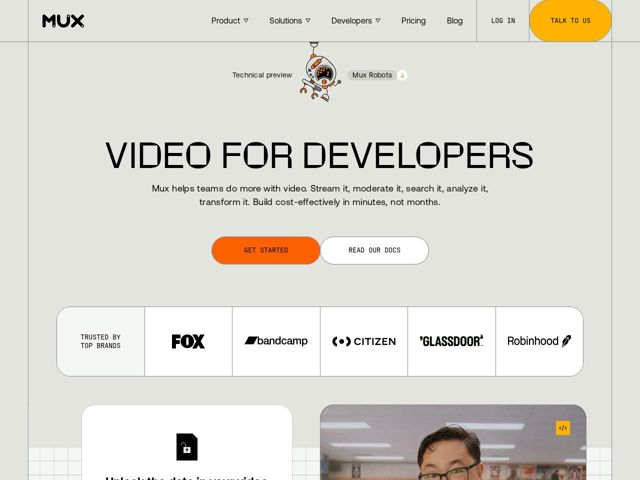

# Mux — https://mux.com

- **niche:** dev-tools (video infrastructure / API)
- **mood:** technical-dark
- **style:** mono-type, minimal, bold, illustrated
- **palette:** bg `#FAFAF8` · ink `#111111` · accent `#FF4A00` — Pílula de CTA principal (GET STARTED), os ícones flutuantes de código/robô, orbe de destaque secundário no botão talk-to-us e estados de link/hover; o laranja faz quase todo o trabalho contra um fundo quase-branco off-white
- **type:** display *Monoespaçada geométrica (tracking largo, caixa-alta alta e condensada — a fonte custom 'Mux Mono' / estilo Akkurat Mono da Mux)* · body *Serifa humanista (serifa de livro transicional para subtítulo e texto corrido — uma combinação inesperada contra a display mono)* — Engenheiro encontra editorial: o headline mono em caixa-alta lê como um banner de terminal enquanto o corpo serifado lê como uma revista, sinalizando 'infra séria, mas feita por gente com bom gosto'
- **sections:** nav › hero › logos › feature-grid › code-embed-demo › feature-infrastructure › feature-languages-sdks › testimonials › cta › footer
- **signature:** O headline aparece num banner MONOESPAÇADO largo em caixa-alta ("VIDEO FOR DEVELOPERS"), mas a frase de apoio cai para uma SERIFA humanista quente — um choque deliberado mono+serifa que quase nenhuma página de dev-infra ousa, mais um mascote robô de desenho à mão encaixado no hero onde concorrentes colocariam um screenshot de dashboard.
- **imagery:** Majoritariamente conduzida por tipografia sobre um fundo tênue de papel quadriculado de engenharia (linhas de grade sutis sangram nas bordas). A única "imagem" no topo é um mascote robô laranja-e-cinza peculiar ilustrado à mão ("Mux Robots"). Abaixo da dobra: frames de vídeo fotográficos do mundo real embutidos dentro de cards brancos arredondados com um chip de código </> flutuante, mais logos de marca monocromáticos (Fox, Bandcamp, Citizen, Glassdoor, Robinhood) numa barra de logos com borda. Ilustração + footage real em vez de mockups de UI.
- **copy:** Direta, confiante, falando direto com o desenvolvedor — nomeia a audiência em vez do produto. Hero: "VIDEO FOR DEVELOPERS" com sub "Mux helps teams do more with video. Stream it, moderate it, search it, analyze it, transform it. Build cost-effectively in minutes, not months."

**Takeaways (roube como ideias, não copie):**
- Combine um headline display em MONOESPAÇADA geométrica caixa-alta com um corpo em SERIFA humanista — o atrito entre 'máquina' e 'editorial' lê instantaneamente como premium e humano numa categoria dev afogada em Inter.
- Apoie-se em UM destaque quente (um único laranja) contra um fundo quase-branco off-white e deixe-o carregar o CTA, os ícones e o mascote — a contenção faz a única cor parecer alta.
- Injete personalidade com um mascote desenhado à mão ('Mux Robots') no hero em vez do obrigatório screenshot de produto — humaniza infra hardcore sem infantilizá-la.
- Use uma grade tênue de papel quadriculado de engenharia sangrando das bordas da página como textura, não decoração — sinaliza 'feito por engenheiros' de forma subliminar sem um único bloco de código literal.
