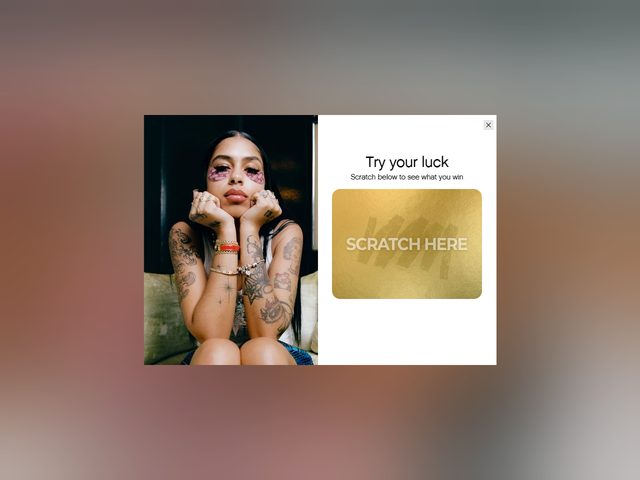

# Topicals — https://mytopicals.com

- **niche:** beauty
- **mood:** warm-playful
- **style:** photographic, editorial, candid, warm
- **palette:** bg `#EFEAE3` · ink `#1C1A18` · accent `#C99B4E` — O dourado vive quase inteiramente dentro da própria raspadinha: um painel de foil metálico escovado ("SCRATCH HERE") que lê como um bilhete de loteria de verdade, contrastado contra um modal de resto neutro creme-e-branco. Tons quentes de pele e os tapa-olhos magenta carregam o resto da cor.
- **type:** display *serifa humanista (pense Canela / Saol) para "Try your luck"* · body *grotesca neutra (Helvetica Now / Aktiv)* — Suave, amigável, conversacional; a tipografia fica pequena e deixa a fotografia falar.
- **sections:** hero › promo-modal › product-grid › ingredient-science › before-after-testimonials › community-ugc › cta › footer
- **signature:** A primeira dobra é construída em torno de um modal gamificado de "raspar-para-ganhar" — um bilhete de loteria literal em ouro escovado que você arrasta para revelar um prêmio — sobreposto diretamente à foto editorial do hero. Em vez de um close de beleza polido, a modelo do hero usa as máscaras magenta para os olhos sem retoque, tatuagens e pulseiras de amizade totalmente visíveis, largada num sofá com o queixo apoiado nos punhos. Troca deliberadamente o glamour aspiracional por uma energia sem filtro, de garota-de-verdade-no-quarto-dela, e então gamifica o desconto em vez de só estampar um banner.
- **imagery:** Fotográfica, luz natural quente, fotografada como um retrato espontâneo em vez de uma campanha de estúdio — granulado de filme visível, sombras suaves, as máscaras magenta sob os olhos como prova do produto usada NO rosto. Sem 3D, sem ilustração; o argumento visual é "esta é uma pessoa real usando isto."
- **copy:** Casual e brincalhona de programa de prêmios. O headline do modal diz "Try your luck" com o subtítulo "Scratch below to see what you win", e o próprio painel de foil diz "SCRATCH HERE" — transformando o momento de captura de e-mail/desconto numa pequena recompensa em vez de um pedido pesado.

**Takeaways (roube como ideias, não copie):**
- Gamifique o desconto: renderize a promo como um bilhete raspadinha de foil com cara de real ("SCRATCH HERE") para que resgatar um código pareça ganhar, não dar opt-in.
- Deixe o produto ser usado no hero — tapa-olhos magenta NO rosto da modelo — para que o estado "antes" seja o visual, sem precisar de diagrama separado.
- Escale e fotografe para a realidade: tatuagens, pulseiras, uma pose espontânea largada e granulado visível leem como autênticos e superam fotos de campanha de estúdio brilhantes para beleza Gen-Z.
- Mantenha o destaque metálico confinado ao único elemento que precisa parecer valioso (o bilhete), e deixe o resto do canvas em creme neutro para que ele salte.
