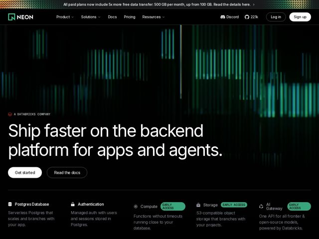

# Neon — https://neon.tech

- **niche:** dev-tools (serverless Postgres / backend platform for AI agents)
- **mood:** technical-dark
- **style:** dark, gradient, cinematic, mono-type
- **palette:** bg `#0A0A0B` · ink `#FFFFFF` · accent `#00E599` — o verde-neon aparece na logomarca, nas pílulas EARLY ACCESS e satura a visualização de equalizador de áudio do hero; deliberadamente racionado contra o canvas quase-preto
- **type:** display *Inter (apertada, peso quase de display)* · body *Inter* — Engenhada e objetiva — uma única grotesca neutra fazendo dois papéis, com o hero superdimensionado num espaçamento de letras denso para que a própria tipografia leia como a marca, em vez de qualquer fonte decorativa
- **sections:** topbar-announcement › hero › feature-grid › feature-cloud-primitives › feature-autoscaling › feature-branching › feature-no-platform-fees › how-it-works › stats › logos › cta › footer
- **signature:** A "imagem" do hero é um equalizador de dados literal — barras verticais de frequência em verde-neon renderizadas contra o preto, então o visual lê como um sinal de banco de dados/throughput ao vivo em vez do habitual blob de gradiente abstrato ou screenshot de produto. A cor da marca É o dado.
- **imagery:** Sem screenshots de produto ou fotografia de banco de imagens no topo. Em vez disso, um campo generativo no estilo espectro de áudio de barras verticais verdes brilhantes esmaecendo do sólido ao preto — conota sinal, escala e infraestrutura "viva". A fileira de features usa minúsculos ícones de linha monocromáticos + pílulas de status "EARLY ACCESS" verde-limão, mantendo a superfície plana, técnica e parecida com um dashboard.
- **copy:** Promessa de infra confiante e direta voltada a quem constrói agentes de IA — o hero diz "Ship faster on the backend platform for apps and agents."; o subtexto se apoia no enquadramento da "AI Engineering era" ("Integrate with a single command and the LLM does the hard work.").

**Takeaways (roube como ideias, não copie):**
- Transforme sua cor de destaque numa visualização de dados: renderize o hero como um sinal/equalizador no tom da sua marca contra o quase-preto para que a imagem funcione também como metáfora do produto (throughput, escala, vivacidade).
- Use pequenas pílulas de status ('EARLY ACCESS') inline na grade de features para sinalizar momentum de roadmap e deixar uma página anunciar primitivos entregues + futuros de uma vez.
- Combine um headline enorme de grotesca única com tracking apertado com um eyebrow quase-invisível de empresa-mãe ('A DATABRICKS COMPANY') — a tipografia carrega a marca, então nenhum lockup de logo é necessário.
- Lidere a grade de features com primitivos nomeados (Database, Auth, Compute, Storage, AI Gateway) numa fileira de 5 — enquadre o produto como infraestrutura componível, não uma ferramenta única.
