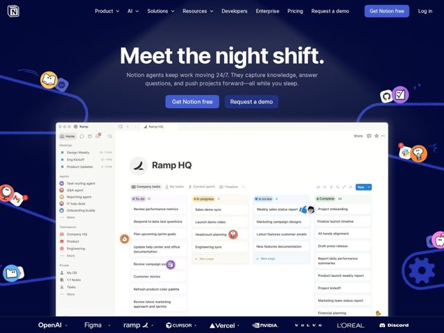

# Notion — https://notion.so

- **niche:** productivity
- **mood:** technical-dark
- **style:** dark, illustrated, colorful
- **palette:** bg `#10172A` · ink `#FFFFFF` · accent `#5B7CFA` — primary CTA button fill ('Get Notion free'), secondary button outline/text ('Request a demo'), and small in-product highlight chips
- **type:** display *Inter (Notion's geometric grotesk; very tight tracking, heavy weight)* · body *Inter* — Massive, ultra-tight, near-black weight headline that reads almost like a logotype; clean neutral sans body — modern, engineered, friendly-serious
- **sections:** hero › feature-agents-247 › feature-automation › feature-assistants › how-it-works-agent › feature-search › feature-notes › feature-integrations › feature-simple-powerful › feature-source-of-truth › feature-tracking › feature-fewer-tools › logos › custom-agents-showcase › footer
- **signature:** The "night shift" concept made literal: a near-black gradient sky with a soft top spotlight, and 3D sticker-emoji "agents" strung along dotted-line paths around a bright product screenshot — the dark mood is the metaphor (work happening while you sleep), not just a theme.
- **imagery:** Product-screenshot-led: a large, realistic Notion workspace UI (Ramp HQ board with kanban columns) sits on a dark canvas, framed by a swarm of 3D glossy emoji/sticker characters and looping hand-drawn dotted paths that connect them — agents personified as little mascots crawling around the product.
- **copy:** Benefit-as-personification, playful and confident: hero headline is "Meet the night shift." with subhead "Notion agents keep work moving 24/7. They capture knowledge, answer questions, and push projects forward—all while you sleep." Section heads use punchy antithesis ("Less tracking. More progress.", "More productivity. Fewer tools.").

**Takeaways (steal as ideas, don't copy):**
- Make the dark theme earn its keep narratively — tie 'dark' to a story (night shift / works while you sleep) so the mood reads as intentional, not default.
- Set the hero H1 enormous with negative-to-tight letter-spacing and the heaviest weight so it behaves like a wordmark, then keep the subhead small and muted grey for max contrast.
- Personify the abstract feature (AI agents) as recurring 3D glossy sticker mascots scattered on dotted connector paths around the UI — gives a technical product warmth and motion.
- Write section headers as paired antitheses ('Less X. More Y.') for rhythm and instant value framing instead of generic feature nouns.
- Float a single bright, realistic product screenshot on the dark field so the UI itself becomes the main light source / focal point of the page.
