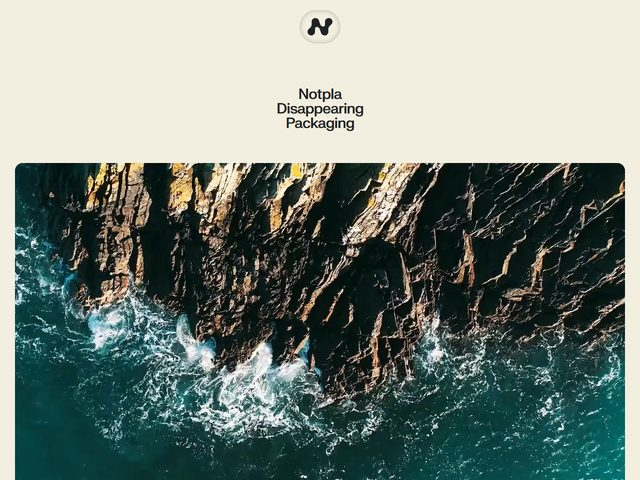

# Notpla — https://www.notpla.com

- **niche:** nature
- **mood:** editorial-minimal
- **style:** photographic, editorial, minimal, organic
- **palette:** bg `#F2EFE6` · ink `#1C1B18` · accent `#1B5E55` — O destaque não é uma amostra aplicada à UI; é o verde-teal profundo da água real do oceano na foto do hero, então a cor da marca é *extraída da própria imagem* em vez de pintada no chrome. Sem botões ou chips coloridos na primeira dobra.
- **type:** display *grotesca geométrica (Aktiv Grotesk / Neue Haas Grotesk), pequena, centralizada, encorpada* · body *mesma família grotesca* — Quieta, confiante, contenção quase de rótulo de embalagem; a tipografia sussurra enquanto a foto grita.
- **sections:** hero › problem-plastic-crisis › products-seaweed-coating › impact-stats › partners-logos › story › cta › footer
- **signature:** A primeira dobra inverte a hierarquia usual de hero: um logotipo minúsculo centralizado e um pequeno headline de três linhas flutuam numa margem generosa de creme, e então uma enorme foto aérea de drone de ponta a ponta de ondas se quebrando contra um litoral acidentado toma conta dos dois terços inferiores. O headline é deliberadamente *subdimensionado* contra a foto — a imagem carrega o peso emocional, a tipografia apenas a rotula. Batizar o produto de "Disappearing Packaging" no mesmo fôlego que a espuma que se dissolve das ondas é um trocadilho visual sutil: o mar literalmente dissolve a rocha do jeito que a embalagem deles se dissolve.
- **imagery:** Uma única fotografia de natureza aérea/drone em full-bleed — vista de cima da água teal do Atlântico e penhascos escuros e molhados, alto contraste, gradação de cor naturalista sem overlays ou filtros. Documental, não encenada; a foto é levemente arredondada nos cantos superiores para que leia como uma placa emoldurada na página creme em vez de um fundo.
- **copy:** Contenção simples, quase acadêmica, montada como uma coluna central empilhada de três linhas — "Notpla / Disappearing Packaging". Sem verbo, sem hype, sem exclamação; o nome da categoria do produto faz todo o trabalho e a foto fornece o sentimento.

**Takeaways (roube como ideias, não copie):**
- Extraia o destaque da sua marca *da* fotografia do hero (o teal do oceano) em vez de escolher uma amostra e tingir a imagem para combinar — a paleta parece inevitável e natural.
- Subdimensione o headline de propósito e deixe uma foto full-bleed carregar a emoção; tipografia pequena e centralizada sobre uma imagem vasta lê como confiança editorial, não fraqueza.
- Coloque o produto sobre um off-white quente (`#F2EFE6`, não branco gritante) e encaixe a foto com cantos superiores suaves para que ela leia como uma placa emoldurada, dando à página uma sensação tátil de papel que combina com uma marca de sustentabilidade.
- Deixe o nome ser um trocadilho visual quieto sobre a imagem (embalagem "Disappearing" ao lado de ondas que se dissolvem) para que o conceito aterrisse sem uma única frase explicativa.
